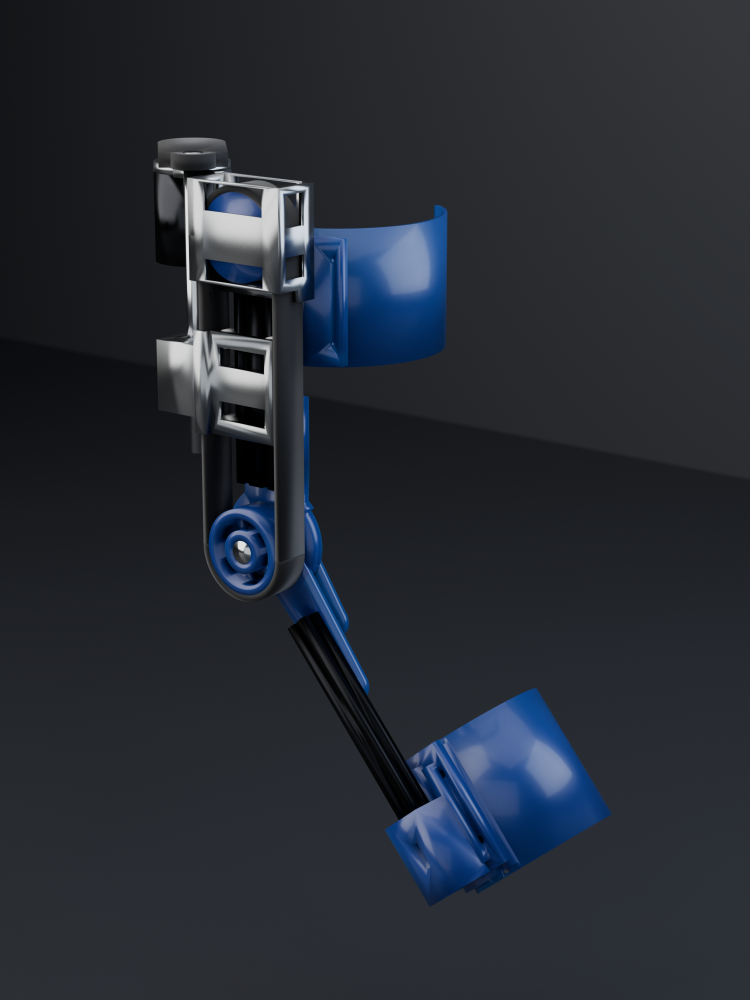
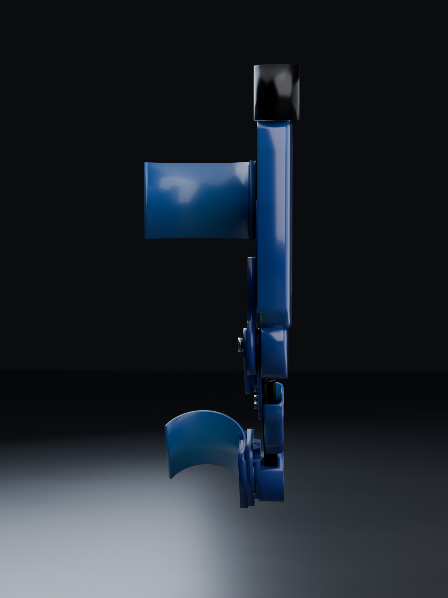
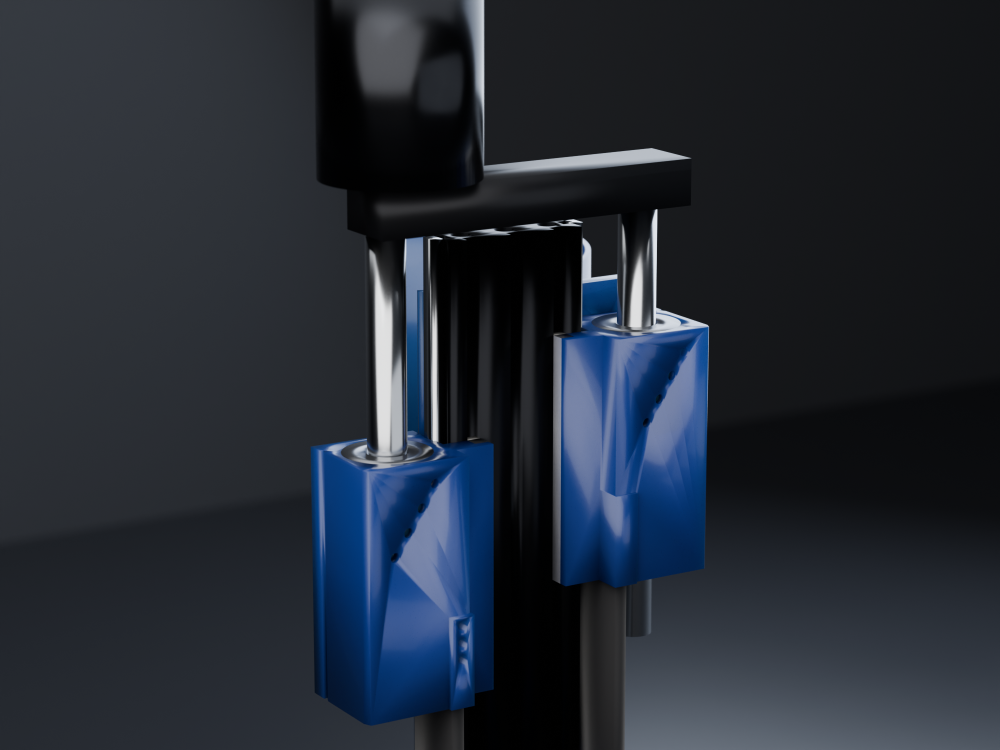

<div align="center">

# Powered Knee Orthosis



<sub>Cycles render · 512 samples · the CAD itself is below</sub>

**28.2 N·m** · **36.92 mm moment arm, constant at every angle** · **86 mm proud of the knee** · **0 clashes in 107 poses**

</div>

---

> [!WARNING]
> **This is not a validated medical device.** No FEA has been run — every number here is a
> hand calculation, and the ones that matter are shown so you can check them. Cuffs are
> sized nominally for 1.75 m / 80 kg. Do not fit this to anyone without a clinician in the
> loop and a bench test under the loads listed.

## The problem

A patient a year out from knee surgery, struggling with walking and — particularly —
stairs. Stair ascent is the hard case: it demands the largest knee extension moment of any
activity of daily living, roughly **1.05 N·m/kg**, and it is exactly where a weak knee
buckles.

The target is **~30% assist**, not replacement. At 80 kg that is **28.2 N·m**, over a range
of motion of **−2° to 104°** — full extension to a deep enough flexion to sit down.

Everything else in this repository follows from those two numbers.

---

## It moves like this

A full flexion cycle, 0° → 104° → 0°, from 32 poses exported straight out of FreeCAD and
rendered in **Cycles**. Left: the mechanism. Right: the same cycle with the fairings on.

<div align="center">
 
</div>

Watch the two carriages in the left animation. They move in **opposite directions**, and
that is the whole idea.

<div align="center">

</div>

---

## How it works

<div align="center">
 
<br><sub>FreeCAD viewport · mechanism, and the same thing clad on the reference limb</sub>
</div>

A **belt capstan** at the knee, driven by **two opposed ball screws**:

| | |
|---|---|
| **Axes** | +Y proximal, **Z is the knee axis** so Z is medial-lateral, +X posterior. This is a **lateral upright** — the whole device hangs off the outside of the leg |
| **29T HTD-8M pulley** | concentric with the knee pin, integral with the shank hinge fork |
| **180° belt wrap** | both runs parallel to the thigh rail, at X = ±36.9 mm |
| **Two carriages** | on one 20×60 V-slot rail, one per belt run |
| **RH and LH screws on a common shaft** | so one carriage rises exactly as the other falls |
| **Delrin L-gib sliders** | one tongue in the rail's outboard slot, one in the side slot |
| **6374 BLDC + ODrive S1** | torque control only, never position |

### Why the differential is exact, not approximate

This is the part worth understanding, because it is what makes the whole architecture work.

Belt length from anchor A, around the pulley, to anchor B is:

```
L = Ya + πR + Yb
```

With a **fixed 180° wrap**, `πR` is a constant, so conservation of belt length reduces to:

```
Ya + Yb = const
```

Two equal-pitch left- and right-hand screws on one shaft give exactly `dYa = −dYb`. That
is not an approximation of the constraint — it **is** the constraint, expressed in
hardware. The belt cannot go slack and it cannot be over-tensioned by driving the motor,
because the mechanism has no way to change `Ya + Yb` at all.

Here is that being true, in the model. Same camera, same scale, orthographic; only the
knee angle differs. Watch carriage **A** (left) and **B** (right) trade places:

<div align="center">
 
<br><sub>FreeCAD · full extension (θ = 0°) and full flexion (θ = 104°).
A drops 68.3 mm, B rises 68.3 mm, the sum never moves.</sub>
</div>

Verified constant at **242.00 mm** across all 107 poses, and re-checked on every one of the
32 animation frames above:

```
f00 theta   0.00  carrA 152.00  carrB 138.00  sum  242.00
f07 theta  41.86  carrA 125.03  carrB 164.97  sum  242.00
f15 theta 103.00  carrA  85.62  carrB 204.38  sum  242.00
f23 theta  62.14  carrA 111.95  carrB 178.05  sum  242.00
```

**This only works because both runs are parallel.** With an angled run, `Ya + Yb` becomes
nonlinear in θ and the two rigid screws fight the belt. Parallel runs are not a styling
choice; they are load-bearing on the maths.

### The second gift: a constant moment arm

<div align="center">

<br><sub>FreeCAD · the 29T capstan, the yoke, and the 180° wrap</sub>
</div>

A capstan's moment arm is its pitch radius, and a pitch radius does not change with angle.
So the device delivers **36.92 mm at 0° and 36.92 mm at 104°** — no dead spots, no torque
curve to compensate for in software, no linkage singularity. Compare a slider-crank, whose
effective arm collapses towards the ends of travel; that was the first architecture tried
here, and it is in the graveyard below partly for this reason.

---

## Four architectures that did not survive

Each of these was **built and measured**, not discarded on paper. The number in the last
column is the one that killed it.

| # | Approach | Why it died | Killer number |
|---|---|---|---|
| 1 | Rigid rod + rod ends to a clevis | Clevis put the full load in tension across two M5 T-nuts, over a 75 mm path crossing two bolted joints | **1269 N**, SF **1.16** |
| 2 | Pure belt drive, motor → knee | A single stage cannot give the ratio. 65T/14T = 4.67:1 needs 6.04 N·m from a motor that peaks at 3.5 | **6.04 vs 3.5 N·m** |
| 3 | Screw + belt + constant-force spring | Spring was pure parasitic loss, gave an unpowered flexion bias, and a skipped tooth loses position permanently | **119 N** loss, **4.2 N·m** bias |
| 4 | C-Beam 80×40 rail | Belt runs are 71 mm apart but the rail half-width is 40 mm, so the belt had to be *lifted over* the rail — giving a 57 mm hub cantilever | pin **SF 1.01**, hub **SF 0.51** — failing |

Architecture 4 is the instructive one. Switching to a C-beam looked like an upgrade: a
stiffer rail, an enclosed channel to hide the belt in. But the C-beam is *wider* than the
20×60, and once the rail is wider than the belt run spacing, the belt has nowhere to go but
over the top. That 57 mm cantilever took the PETG hub to a **safety factor of 0.51** — it
would have snapped.

The fix was to go **back** to a narrower rail and run the belt down beside it. Current
state, with the belt at the same height as the rail:

| | C-beam, belt lifted | 20×60, belt beside |
|---|---|---|
| Hub moment | 62.2 N·m | **18.5 N·m** |
| Knee pin | M10, 633 MPa, SF 1.01 | **M12, SF 5.9** |
| PETG hub | 29.4 MPa, **SF 0.51** | **SF 3.7** |

### The measurement that caused it

I had been assuming for some time that the two belt runs partly cancel at the pin. They do
not. **Both runs leave the pulley on the proximal side, so their tensions add** — 764 N of
differential plus 150 N of pretension on each side gives **1091 N net into the knee pin**.
Checking that one sign is what exposed the lifted-belt layout as unbuildable.

---

## Two findings worth keeping

**The seat law.** Any point on the shank swings to approximately its own radius
*posteriorly* at 90° flexion. So if you do not want a part digging into a chair when the
patient sits, keep its radius from the knee axis below the seat clearance. This caps the
pulley at **R ≤ 52 mm** — the 36.92 mm capstan passes easily, while the old rod pivot at
**R = 74.7 mm** did not, and that is why sitting down in architecture 1 was unpleasant.

**Belt tension cannot be servo-controlled, and never could.** The shaft fixes `Ya + Yb`, so
turning the motor changes tension *not at all*: there is no control authority, and no
sensor can close that loop. Pretension is invisible at the motor too, because it pulls both
carriages distally and the opposite screw hands cancel the torques exactly.

Worse, the differential is **too stiff to hold pretension**. 150 N is only 0.27–0.53 mm of
belt stretch, while a new HTD belt beds in by 0.7–1.8 mm — so the pretension would simply
vanish during break-in, with nothing able to take it up.

Hence the **sprung anchor** on carriage B: 3 mm of travel at ~500 N/mm, which absorbs
bedding-in in one twentieth of the travel the abandoned constant-force drum needed. Cost:
1.58 mm of lost motion, **2.45° of knee angle**. Bonus: a Hall sensor on that slide reads
its deflection as **live belt tension**, which is the only tension measurement the machine
can make.

---

## Drivetrain

Everything below is derived in [`scripts/300_drivetrain.py`](scripts/300_drivetrain.py) —
one file, so there is a single place to change an assumption.

### The screw lead is the biggest open decision

Reflected rotor inertia scales with the **square** of the total knee→motor ratio. This is
what the patient feels whenever the motor is off: a dead battery, a fault trip, or simply
the free-swing phase of every single step.

| Screw | Ratio | Screw revs over ROM | Reflected J | **vs. the limb's own J** | Peak current | Nut OD |
|---|---|---|---|---|---|---|
| SFU1605 | 46.4 | 13.66 | 0.667 kg·m² | **2.22×** | 10.9 A | 28 mm |
| **SFU1610 — built** | 23.2 | 6.83 | 0.167 kg·m² | **0.56×** | 21.7 A | 36 mm |
| SFU1620 | 11.6 | 3.42 | 0.042 kg·m² | 0.14× | 43.5 A | 40 mm |

At **SFU1605 the leg would feel roughly three times as heavy to swing as it does bare.**
For someone already struggling to walk, that is a worse device than no device at all.

And you cannot gear your way out of it. Only the **total** ratio matters, so "SFU1620 plus
a 4:1 reduction" is inertially identical to SFU1605 direct. The only levers are a lower
total ratio (which costs motor current) or a lower-inertia rotor.

**SFU1610 is the right answer, and it is what the model now carries.**

This used to carry a caveat that the 1610 nut fouled the belt by 1.1 mm and the screws had
to move out to ±62. That was wrong, and wrong in an instructive way: it compared the nut
and the belt *projected onto the X axis* — 58 − 18 = 40 against the belt's outer face at
41.1 — and never checked whether they share any length. They do not. The nut sits at
`carrA + 36` and its belt run ends at `carrA − 24`, a constant **60 mm apart at every
pose, by construction**. Swept over all 107 poses the overlap is **0.000 cm³ for OD 28,
OD 36 and OD 40 alike**.

What *does* run alongside the belt is the screw shaft, and at r = 7.9 it stays clear until
|X| < 49.

Building it ([`240_nut1610.py`](scripts/240_nut1610.py) and
[`241_fixups.py`](scripts/241_fixups.py)) took three changes, two of which only the sweep
found:

- **The carriage body** has to grow to X 34…80, Z 84…128 to capture a 36 mm bore with a
  3.8 mm wall on all three faces.
- **Its top-outboard corner then clipped `P21` by 0.495 cm³** — *trap 2 again*: a
  superellipse is not 84 wide everywhere, and by Z = 128 its half-width has fallen to 83.3
  and its inner wall to ~80.3. Rather than guess a chamfer, the carriage is simply **cut by
  `P21`**. The fairing's section is constant over Y 58…300, which covers the whole travel
  band, so one cut clears every pose and the chamfer matches the fairing exactly.
- **Carriage B then hit the thigh cuff, 8.67 cm³** at X 34…70, Z 84…88. The body had to
  drop to Z = 84 for the nut and the cuff tops out at 88 — but only on the +X side, where
  it wraps further round the limb, which is why carriage A was clean and only B clashed.
  The cuff bolts to the rail's medial face at |X| < 30, so the wrap-around material out at
  X 32…82 gets a corridor cut through it.

Swept over all 107 poses: **zero hard-part clashes**, knee standoff unchanged at 86 mm.

### Motor

| | |
|---|---|
| Motor | 6374 outrunner, 149 Kv, 14-pole |
| Torque constant | 0.0641 N·m/A |
| Shaft torque | 0.70 N·m at 5 mm lead · 1.39 N·m at 10 mm |
| Peak current | 10.9 A at 5 mm lead · **21.7 A at 10 mm** |
| Peak speed | 2320 rpm at 5 mm · 1160 rpm at 10 mm |
| No-load at 36 V | 5364 rpm — 2.3× headroom |
| Controller | ODrive S1, 12–50 V, 40 A continuous |

### Energy

Lifting 80 kg by a 170 mm stair rise is 133 J. The knee does about half; the exo supplies
40% of that at 55% wall-to-shaft — so **49 J per step, electrical**.

| Use | Draw | Hoverboard 360 Wh | Ebike 504 Wh |
|---|---|---|---|
| Stair climbing, 1 step/s | 57 W | 6.4 h | 8.9 h |
| Level walking | 23 W | 15.5 h | 21.6 h |
| Mixed daily use | 12 W | 30.9 h | 43.3 h |

**Energy is not the constraint.** Both packs comfortably outlast a day, so the battery gets
chosen for its *mount*, not its capacity — see [`docs/BOM.md`](docs/BOM.md) §7.

---

## Packaging

<div align="center">
  
<br><sub>FreeCAD orthographic coronal and sagittal · then the same coronal profile as a Cycles render</sub>
</div>

The device sits **86 mm proud of the knee** clad, 80 mm bare. That left-hand orthographic
sagittal view is the one that matters — that thin edge is the number deciding whether it
fits under trousers.

### The enabling observation

The pulley's **inside** is what swings. Measured across the full sweep, nothing moving
occupies r = 41…70 mm at Z = 96…126, and once the knee pin head is recessed flush at
Z = 126, nothing at all sits above that plane. So the belt and the pulley's outer face can
be **completely enclosed by static covers** tied into the thigh fairing — no moving shroud,
no sliding seal.

Two changes were needed first, both about **swept** volume rather than static shape:

- **A4's proximal end moved from Y = −45 to Y = −70.** Its inner corner swung at r = 45 mm,
  leaving only **3.88 mm** above the belt. At −70 it swings at r = 70.7 mm, giving
  **28.9 mm**. The length was doing nothing — the fork bolts are at Y −90…−125 and the
  socket engages at −208…−318.
- **The yoke's disc went back to a full r = 47 mm**, with the fork outer cheek's *swept
  sector* (r 43…49 mm, angles 241°…43°) cut away. An earlier r = 30 had been cut "to clear
  the belt wrap" — but the yoke lives at Z 76…88 and the belt at Z 96…126. Radius was never
  the constraint. The cut was right; the reason was wrong, which meant it was cut in the
  wrong place.

### Fairing geometry

Sections are **superellipses at exponent 5.5** — a rounded rectangle, not a slab:

```
(x/a)^5.5 + (z/b)^5.5 = 1
```

The thigh fairing flares from 58 → 84 mm half-width over Y 28…58 on a smoothstep, carries
eight vent slots, and mounts on a **central spine into the rail's middle outboard slot at
X = 0** — the one channel nothing else uses, since the carriages take X = ±20 outboard and
X = ±30 side. So the mounts are never swept.

| Part | Covers |
|---|---|
| `P20_KneeCap` | an inverted-U channel — walls at X ±50, roof at Z 132 — enclosing both belt runs and both in-running nips |
| `P21_FairingThigh` | one canopy, Y 28…**290**, over screws, nuts, carriages, both belt runs and the coupling |
| `P22_DriveCap` | Y 290…399 over the drive box and the motor, section centre walking to xc = −20 to follow the motor |
| `P24_FairingShank` | the shank member, Y −208…**−66** — the proximal tip tapers in width and height to duck under the knee shroud through the swing |

`P20` looks like a small nose piece in the renders and is easy to write off. The material
map at Y=0 shows what it actually is:

```
      X  -60   -50   -40   -30   -20   -10     0    10    20    30    40    50    60
Z 124      .     #     .     .     .     .     .     .     .     .     .     #     .
Z 128      .     #     .     .     .     .     .     .     .     .     #     #     #
Z 132      .     #     #     #     #     #     #     #     #     #     #     #     #
```

Two walls at X ±50 and a roof at Z 132, with the belt runs at X ±35.6…41.1, Z 96…126
sitting inside that channel. It is the only guard on either nip — `P21` starts at Y=28 and
the nips are at Y≈0 — and the channel is open only medially, through an 8 mm slot between
the yoke at Z 88 and the shroud at Z 96.5, which no finger fits through.

### Where it stops

Honest limits, because they are the parts a photo hides:

- The fairing is **open below Z = 92**. The thigh cuff tops out at 88 and the carriage
  bottom is at 90 — there is no room for a wall between them. That underside faces the limb.
- **Y −66…−46 is a moving gap** — 20 mm of bare hinge plate, down from 55. A rigid shell
  here has to sweep past the static thigh fairing, so the remainder can never be closed
  and wants a fabric gaiter. See below.
- The motor at the hip is uncovered.

### Why the shank looks bare, and how much of that is necessary

A fair question to ask of the renders. Measured coverage along the limb axis:

| | Hardware span | Faired | Coverage |
|---|---|---|---|
| Thigh | Y 0…388 (388 mm) | `P21` Y 28…312 | **73%** |
| Shank | Y −328…35 (364 mm) | `P24` Y −208…−100 | **30%** |

30% sounds bad and mostly is not, for three separate reasons that are worth keeping apart:

**Most of the shank has nothing to fair.** Every moving part of the transmission — two ball
screws, two ball nuts, two carriages, both belt runs, the motor and the coupling — is on
the thigh. Below the knee there is a rail, a hinge plate, a socket and a cuff, and relative
to the shank *nothing moves at all*. The one genuine pinch hazard down there is the belt
entering the capstan, and `P20_KneeShroud` already closes over both nip points. So the
shank is 30% covered by length but close to 100% covered by hazard.

**The distal 120 mm (Y −328…−208) is the socket and the cuff.** Those are closed
structural shells and the interface to the limb. Putting a fairing over a cuff would be
fairing a fairing.

**The 55 mm gap is the only real hole** — and it is smaller than stated here until
recently. The claim used to be that the shank fairing "cannot start closer than Y = −100",
on the basis that a shell from −66 sweeps to X 70.3 at 104° where the thigh fairing is
already 63.5 mm wide. That is true *of a constant-section shell*, and false as a general
statement. Sweeping candidate extensions through the full ROM against all 25 non-shank
parts at 1° steps:

| Extension | Result |
|---|---|
| Constant ±24 section to Y = −80 | clean |
| Constant ±24 section to Y = −70 | 0.35 cm³ into `P21` at 104° |
| **Tapered tip to Y = −66** (±14, Z 101…117) | **clean** |
| Tapered tip to Y = −60 | 0.20 cm³ into `P20` at 104° |

So **34 of the 55 mm can be closed** by tapering the proximal tip in both width and height
so it ducks under the knee shroud as it swings, leaving a 21 mm gap.

### A static cheek covers the whole fan — and was the wrong answer anyway

All of the above treats the cover as **shank-mounted**, which is why it is constrained at
all — a shank-mounted shell has to sweep past the static thigh fairing. A **thigh-mounted**
cover has no such problem. It never sweeps; it only has to clear the shank *laterally*,
in Z. And that clearance already exists: the hinge plate tops out at Z = 126 and
`P20_KneeShroud` already reaches Z = 133, so **Z 126.5…133 is a free lateral band**.

A static cheek sector on the knee axis, r 40…108 mm, Z 126.5…133, spanning −100°…+26°,
swept against every shank part at 1° steps over the full ROM:

| | Result |
|---|---|
| vs. the moving shank (incl. reference limb) | **clean, 0 cm³ at every pose** |
| vs. static parts | 2.62 cm³ into `P20_KneeShroud` — an overlap to *merge*, not a clash |

That covers the entire 106° fan with **no gap at all**, and no gaiter. It is a single valid
closed solid. The cheek is naturally grown from `P20_KneeShroud`, which is already static
and already at the knee, and bolted through to `P1_KneeYoke` for support — the yoke itself
sits at Z 76…88, medial of the rail, so it is the right *anchor* but the wrong *side* to
grow the skin from.

The same trick closes the top. Nothing moves above Y = 312, and the motor pokes out to
Z = 149.5, past the thigh fairing's 138. A cap of X ±95, Y 310…394, Z 86…154 is clean
against everything that moves, overlapping only `P21_ShellAnterior` by 1.22 cm³ — again, a
merge.

Both were built and both swept clean. **The cheek is not in the model**, because
geometry was never the problem with it: it is a 216 mm flat plate standing off the side
of the knee. That is ugly, and — the part that actually matters — it is a snag hazard in
its own right, sticking out laterally at exactly the height that catches a door frame.
The device is supposed to stop the patient catching on things.

And what it was covering is bare *structural plate*, not mechanism. There is no pinch
hazard out in the fan; the nips are at the capstan and `P20` already closes over both.
Trading a cosmetic gap for a plate that catches door frames is a bad deal.

So the shank tip does the work instead, tapered in both width and height so it ducks
under the knee shroud as it swings, reaching **Y = −66**. `P20` already reaches −46, so
the moving gap is **20 mm**, down from 55, and a fabric gaiter covers it. The drive cap
stays — nothing swings at the hip, so it costs nothing and the motor is a spinning bell
that genuinely wants enclosing.

Building the cap turned up two things the envelope study had not:

- **The cap could not simply butt onto `P21`.** `P21` runs at a constant a=84, b=23,
  zc=115 and then closes from Y=300, while the motor starts at Y=314 already needing
  Z 86.5…149.5. There is nowhere to put the shoulder, so `P21` is trimmed back to Y=290
  and the cap takes over the last 22 mm of canopy.
- **Two constraints set when the cap's section centre may walk outboard.** Walking `xc`
  negative early pulls the posterior wall into the drive box, which runs to X=+70 until
  Y=311; necking down early puts the motor through the wall — 1.22 cm³ of it, at
  Y 370…392. The section stays full until Y=389 because the motor ends at 388.

Two lessons in one section: the shank-fairing limit was the same mistake as the yoke radius
earlier in this project — a cut made for a correct reason, then the reason generalised into
a constraint nobody re-tested. And the better answer came from asking *which frame the
cover lives in*, which is a question the original analysis never posed.

---

## Verification

[`scripts/vlow.py`](scripts/vlow.py) runs a **full pairwise interference sweep with no skip
list** — 107 poses, every part against every other part, in six chunks (the sweep exceeds
FreeCAD's 90 s GUI dispatch limit in a single call).

**Current state: zero hard-part clashes.** The only remaining overlaps are the reference
limb cones intersecting each other, and 0.84 cm³ of thigh-cuff foam compression.

> [!IMPORTANT]
> A skip list hid **six real clashes** earlier in this project, including a carriage bore
> cut along the wrong axis and a telescoping joint that did not telescope. Do not
> reintroduce one. If the sweep is too slow, make it faster — do not make it blinder.

---

## Six traps that cost real time

Recorded because each one produced a *plausible* result that was wrong, which is the
expensive kind of bug.

**1. `obj.Shape` returns geometry with the placement already applied.** A read-modify-write
while a part is posed bakes the pose in permanently. This bit twice — once during a
measurement, where `Shape.Vertexes` returned a live animated pose which I then rotated
*again*. Stop any animation timer and zero every placement before touching geometry.

**2. A boolean that severs a part returns a *valid* shape**, not an error — just with
`len(Shape.Solids) > 1`. Always `assert solids == 1 and isClosed()` after cutting.

**3. Spline lofts overshoot.** `makeLoft(..., ruled=False)` bulged sections out to X ±129
instead of ±83 and self-intersected into two solids. Use `ruled=True` with closer stations.

**4. A superellipse narrows in Z at its X extremes.** Containing a box of half-size (W, H)
requires `(W/a)^n + (H/b)^n ≤ 1`, which is *not* the same as `a ≥ W`. At n = 3.4, b = 22 the
carriage needed **a = 108**; I had used 80. Carriages, cuff, rail and belt all poked through
the walls — **eight clashes, one root cause.**

**5. An inner loft must overrun the outer at both ends**, or `outer − inner` leaves a closed
end wall. Setting the shank fairing's inner to start at Y = −102, distal of the outer's
−100, produced a wall that A4 passed straight through — a constant **0.441 cm³ at every
pose**. A constant overlap across a sweep is the signature of a static modelling error, not
a kinematic one. Read the constant; it tells you where to look.


**6. `Shape.BoundBox` overshoots on lofted surfaces.** The drive cap reports a bounding
box of Y 288…399, Z 82.4…159.5 while its actual material is Y 290…399, Z 92…159.5 — the
box comes from B-spline control points, not the surface. It is exact on prisms and
cylinders, which is why it can be trusted for the ball-nut-to-belt clearances, and loose
on anything lofted. Never quote a clearance off a bounding box without confirming it with
a boolean.

---

## Guides, and why the layout spends the axis it does

The carriage guides are Delrin L-gibs running in the extrusion's slots. The load case is
not the interesting part: the 914 N of belt pull goes straight into the ball screw, and
the guide only takes the couple from the 19.7 mm offset between the belt line and the nut
axis — **176 N at each end of the carriage**. Every linear guide on the market is ten
times overspecified for that.

Friction is the interesting part, and specifically that sliding friction is *unstable*:

| | Friction | Mass | Load capacity |
|---|---|---|---|
| Delrin L-gibs | **70 N** — 7.7% of belt pull | 29 g | fine on contact pressure |
| **MGN7H — built** | **1.4 N** | **95 g** (2 rails, 4 blocks) | 1.00 kN |
| MGN9H | 1.4 N | 150 g | 1.86 kN |
| HGR15 | 1.4 N | 616 g | 7.84 kN |

Beyond the 7.6% recovered, the real argument is stick-slip: a breakaway force different
from the running force, and a μ that wanders with wear and temperature. The whole control
plan is to start at 10% assist and creep up under a physio's supervision, and notchy
low-level torque makes that hard to tune and unpleasant to wear.

**HGR15 is the wrong size** — 616 g for capacity nobody needs.

### Where the rails go, and the 0.9 mm that picked the size

They go on the **20 mm side faces**, rail centre Z = 98, which puts the block at
Z 89.5…106.5 — between the thigh cuff (tops out at 88) and the extrusion's lateral face
(108), entirely inside the carriages' existing envelope. **No dimensional cost at all.**

Getting there took two wrong answers, both from checks that were too small, and both
worth recording because they are the same mistake in different clothes.

**"The side faces clash with the belt."** Wrong for the *blocks*: run A spans
Y 0…`carrA−24` and carriage A's first block starts later, so there is a constant gap at
every pose — the same construction that keeps the ball nut clear. Swept over all 107
poses, block-to-belt overlap is 0.00 cm³ at every rail height tried. But it is right for
the **rail**, which is continuous and therefore does share length with the belt. There is
5.6 mm between the side face at |X| 30 and the belt's inner face at 35.6:

| | Proud of the face | Reaches | vs. the belt |
|---|---|---|---|
| MGN9 rail | 6.5 mm | 36.5 | **0.9 mm into it** |
| **MGN7 rail** | 4.8 mm | 34.8 | clear by 0.8 mm |

**"It clears the cuff."** That test was run on the *anterior* block only. The posterior
side is tighter, because carriage B carries the sprung belt anchor in exactly that corner.
Three changes were needed there and none on the anterior side: the blocks move distal of
the anchor, the anchor moves outboard to X 35.6…44.2, and the tension spring rises to
Z 113 so the block passes under it. Block spacing on B drops to 34 mm as a result, so the
18.0 N·m yaw becomes **529 N per block** against MGN7H's ~1.0 kN dynamic rating — 1.9× on
a peak, not a continuous, load. Carriage A keeps 54 mm and 333 N.

**And a question no interference sweep can ask: can it be bolted on?** The first build
centred the rail on the face at Z = 98 — straight over the V-slot, which `194_layout.py`
cuts at Z 95…101. Every M2 mounting screw would drop into the slot with nothing to grip,
and M2 T-nuts do not exist for a 6 mm slot. The face leaves two solid bands, Z 88…95 and
Z 101…108, each 6.9 mm against the rail's 7 mm. The inboard one puts the block back into
the thigh cuff, so the rail sits on the **outboard** band, centre Z = 104.5, block at
Z 96…113 — which in turn pushed the tension spring up to Z 119 to stay clear of it.

Rail length is cut to what the blocks actually sweep rather than to the extrusion:
**165 mm anterior** (blocks sweep Y 67.0…220.8) and **145 mm posterior** (Y 146.7…280.5).
They differ because the carriages sit at different heights and B's blocks were pushed
distal of the anchor.

This placement also leaves the lateral 60 mm face completely free, which is what the
front-mounted screw layout below would need.

### Why the screws stay at X = ±58

Moving them to the lateral face looks like it saves a lot of width, and it does — but it
spends the wrong axis. Measured against the reference limb:

| Y | Limb radius | Device fore-aft | Proud laterally |
|---|---|---|---|
| 140 | ±72.1 | ±84 | 65.9 mm |
| 200 | ±76.9 | ±84 | 61.1 mm |
| 260 | ±81.8 | ±84 | 56.2 mm |

Fore-aft the fairing clears the limb's own silhouette by only **2–12 mm**; laterally it
stands 56–66 mm proud at the thigh and 86 mm at the knee. Lateral protrusion is what
catches door frames, chair arms and the other leg. Fore-aft is nearly free, because the
thigh is already that wide.

Put the screws on the lateral face and the ball nut has to clear the rail's Z=108 face,
so its axis sits at Z ≥ 122 (SFU1605) or ≥ 126 (SFU1610); the nut reaches Z 136 or 144,
the carriage has to wrap it, and the fairing follows to ~148 or ~156. **Knee protrusion
goes 86 → 96 mm, or 104 mm on 1610.** The return is ~32 mm per side of fore-aft, of
which only ~12 mm was ever outside the limb.

So the current layout is already spending the cheap axis. The mass of the rails lands on
the thigh, which does not swing about the knee, so it costs hip effort rather than the
reflected inertia the screw-lead decision is fighting — the cheap place to spend 219 g.

Numbers: [`scripts/310_guides.py`](scripts/310_guides.py).

---

## Sensing

<div align="center">

<br><sub>Cycles render · the drive head, both carriages and their Delrin gibs</sub>
</div>

| | |
|---|---|
| **Knee angle** | AS5048A, 14-bit absolute, on a 6 mm diametric magnet sunk into the knee pin's flush counterbore. Absolute at power-on, so **no homing routine** — critical, because the screw turns 6.8 revolutions over the ROM and a motor-side encoder cannot tell which one it is on |
| **Motor** | ODrive's onboard MA732, commutation and velocity |
| **Tooth-skip detection** | one tooth is 8 mm of belt = **12.9° of knee angle**. Comparing joint angle against motor position makes a skip unmissable — this is the monitor for the failure mode that actually matters, sudden loss of assist mid-stair |
| **Belt tension** | Hall sensor on the sprung anchor's slide, reading its deflection |
| **Endstops** | magnet pockets in each carriage side wall — hard limits plus auto-calibration of the screw↔knee map |

Full architecture, ODrive configuration, control strategy, regen handling and the bring-up
order: [`docs/ELECTRONICS.md`](docs/ELECTRONICS.md).

The headline: **torque control only, never position** — a position loop fights the patient
whenever their intent differs from the trajectory, which is most of the time. And the
failure mode is benign by construction: a ball screw backdrives at ~89%, so loss of power
leaves a free-swinging passive brace, not a locked leg. That property is worth protecting.

---

## Repository

```
docs/        BOM.md — build list and the screw-lead decision
             ELECTRONICS.md — ODrive, ESP32, control, safety, bring-up
model/       FreeCAD source (internal document name is KneeExo_v4)
stl/         15 printed parts (PETG) and Delrin slider stock
kinematics/  kin_low.json — current pose law; legacy slider-crank kept for reference
renders/     cad/ FreeCAD viewport captures; Cycles stills and animation GIFs
scripts/     chronological build and verification scripts, over FreeCAD's XML-RPC
```

Scripts are numbered in the order they were run. The live chain for the current design is:

```
194_layout  →  195_knee  →  196_carr  →  197_belt  →  203_makeroom
            →  206_fix   →  210_flush →  217_fairing
```

then `vlow.py` to verify, `219_stl.py` to export, `221_render_export.py` for the stills and
`222_anim_export.py` for the animation frames. Earlier numbers are the design history,
including all four rejected architectures above.

[`scripts/fc.py`](scripts/fc.py) is the FreeCAD client (XML-RPC, `PORT = 9880`).

### Images

Two kinds, and the difference matters when you are reading a shape off one of them:

**FreeCAD viewport captures** ([`renders/cad/`](renders/cad)) are the model itself — flat
shading, edge lines, orthographic wherever the view is a technical one, and the tan
reference limb shown at 75% transparency. Nothing is retouched and nothing is
approximated. Produced by [`scripts/223_cad_shots.py`](scripts/223_cad_shots.py), then
autocropped by [`scripts/crop_cad.py`](scripts/crop_cad.py).

Three things that script has to get right, all of which caught me out first time:

- **`REF_Shank` belongs with the shank.** `vlow.py` has always posed it, so the clash
  sweep was never blind — but `221_render_export.py` and `222_anim_export.py` both omitted
  it. Invisible while the reference limb was hidden; wrong the instant it was shown, with
  the limb standing straight while the device flexed.
- **No standard FreeCAD view stands the device up**, because the limb axis is +Y and
  anterior is +Z. Camera orientation maps the camera frame into world and the camera looks
  down its own −Z with +Y up, so *identity* is the frontal view with the limb vertical.
- **The MCP's `get_active_screenshot` forces a standard view**, silently discarding any
  custom camera. Use the view's own `saveImage` instead.

**Cycles renders** ([`renders/flexed_40deg/`](renders/flexed_40deg),
[`renders/extended_0deg/`](renders/extended_0deg), [`renders/anim/`](renders/anim)) are
presentation: **512 samples**, AgX medium-high contrast, f/11, on 4× RTX 3060 via
`blenderkit/headless-blender:blender-5.0-stable`. Materials are keyed off the `MAT__`
filename prefix the exporter writes, so no lookup table is needed on the Blender side.

Animation: also Cycles, 96 samples. 32 poses on `θ = 52 − 52·cos(2πi/32)`, so the cycle is smooth and loops
seamlessly with no duplicated end frame. 96 samples, three cameras per frame, rig transform
computed **once** from the union of the two extreme poses and then held fixed — otherwise
the per-frame bounding box moves and the whole device jitters instead of the shank swinging
about a stationary knee.

```bash
python scripts/300_drivetrain.py               # every drivetrain number, no FreeCAD needed
python scripts/fc.py run scripts/194_layout.py # build geometry
python scripts/fc.py run scripts/223_cad_shots.py &&   python scripts/crop_cad.py C:/Users/Josh/KneeExo_render/cad
```

---

## Open items

- **No FEA.** Hand calculations only.
- **Screw lead unsettled** — see the drivetrain table. 10 mm is the right answer and it
  fits at X = ±58 as drawn; only the CAD nut needs redrawing from OD 28 to OD 36.
- **Printed mass 1.93 kg** (up from 1.63 with the two new covers) is the largest
  unresolved issue. `P2a` (145 cm³), `P5` (167 cm³),
  `P6` (165 cm³) and `P1` (131 cm³) are the structural candidates for a diet. The 239 cm³ of
  shrouds should print at two walls and low infill — nearer 130 g than 303 g, since they
  carry no load.
- **Carriage guides are sliding, not rolling** — see below. Not changed yet.
- **The motor sits at the hip**, where the reference limb model ends (Y = 300). Its 100 mm
  clearance is measured against nothing and needs a fitting check on the patient.
- **Belt tooth-shear figures come from continuous-duty power ratings**, which carry fatigue
  derating for high-speed running. A slow capstan can run closer to the cord limit — check
  against the actual belt's data before committing.
- **Acoustics are unmeasured.** Ball nut recirculation (~290 Hz) is the likely dominant
  source and the fairing is the likely radiator, since it hangs off a rigid spine into the
  rail. Analysis and mitigations in [`docs/ELECTRONICS.md`](docs/ELECTRONICS.md) §9; bench
  measurement is now step 2 of bring-up. V-wheels were considered as a quieter guide and
  rejected — they ride the extrusion's outer corner V, which on a 20×60 fouls the belt by
  2.1 mm even for a mini wheel, and the 20×40 that would fit is a rebuild of the spine for
  a source that is not the loudest one. See [`scripts/320_rail_section.py`](scripts/320_rail_section.py).
- **Nothing checks assembly.** Every verification in this repository is interference —
  "do two solids overlap". Nothing asks whether a part can be *fastened*, whether a tool
  can reach a screw, or what order things go together in. That gap is how the rails came
  to be modelled directly over the V-slot, where their mounting screws would have had
  nothing to bite.
- **No firmware yet.** Architecture is specified in `docs/ELECTRONICS.md`; no code written.

---

## License

[Apache License 2.0](LICENSE) — hardware, software and documentation alike. Use it, build
it, sell it, fork it; just keep the notice and the disclaimer.

Apache-2.0 rather than MIT for two reasons that matter here: it carries an **explicit
patent grant**, so nobody who contributes can later assert a patent on the mechanism
against the people using it, and its limitation-of-liability clause is far more explicit —
which is worth having on a device somebody might build and strap to a leg.

That disclaimer is not decorative. Re-read the warning at the top before you build one.
