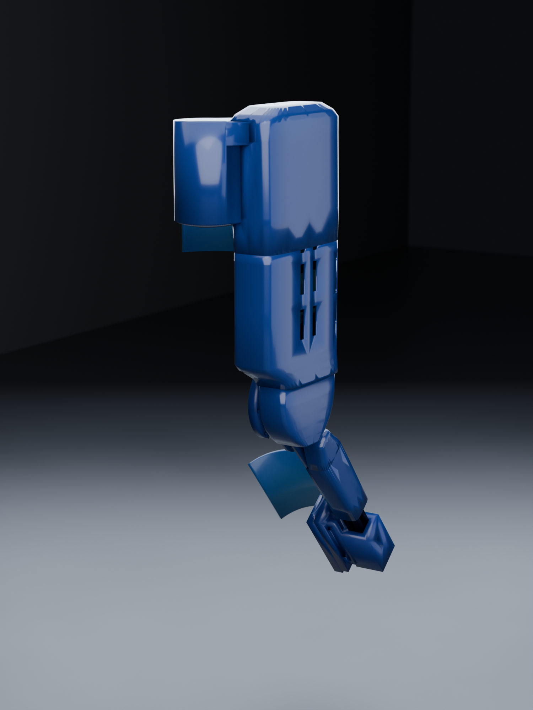
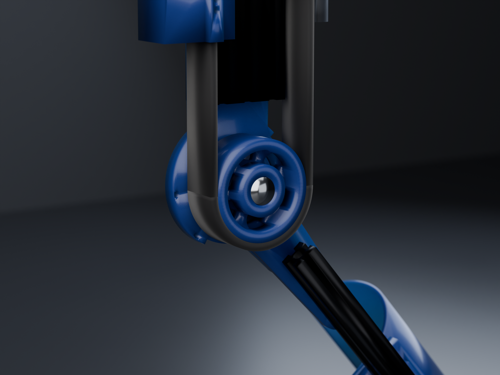

<div align="center">

# Powered Knee Orthosis


**28.2 N·m** · **36.92 mm moment arm, constant at every angle** · **86 mm proud of the knee** · **0 clashes in 107 poses**

</div>

---

> [!WARNING]
> **This is not a validated medical device.** No FEA has been run — every number here is a
> hand calculation, and the ones that matter are shown so you can check them. Cuffs are
> sized nominally for 1.75 m / 80 kg. Do not fit this to anyone without a clinician in the
> loop and a bench test under the loads listed.

## The problem

A patient a year out from knee surgery, struggling with walking and — particularly —
stairs. Stair ascent is the hard case: it demands the largest knee extension moment of any
activity of daily living, roughly **1.05 N·m/kg**, and it is exactly where a weak knee
buckles.

The target is **~30% assist**, not replacement. At 80 kg that is **28.2 N·m**, over a range
of motion of **−2° to 104°** — full extension to a deep enough flexion to sit down.

Everything else in this repository follows from those two numbers.

---

## It moves like this

A full flexion cycle, 0° → 104° → 0°, rendered from 32 poses exported straight out of the
CAD. Left: the mechanism. Right: the same cycle with the fairings on.

<div align="center">
 
</div>

Watch the two carriages in the left animation. They move in **opposite directions**, and
that is the whole idea.

<div align="center">

</div>

---

## How it works

A **belt capstan** at the knee, driven by **two opposed ball screws**:

| | |
|---|---|
| **29T HTD-8M pulley** | concentric with the knee pin, integral with the shank hinge fork |
| **180° belt wrap** | both runs parallel to the thigh rail, at X = ±36.9 mm |
| **Two carriages** | on one 20×60 V-slot rail, one per belt run |
| **RH and LH screws on a common shaft** | so one carriage rises exactly as the other falls |
| **Delrin L-gib sliders** | one tongue in the rail's outboard slot, one in the side slot |
| **6374 BLDC + ODrive S1** | torque control only, never position |

### Why the differential is exact, not approximate

This is the part worth understanding, because it is what makes the whole architecture work.

Belt length from anchor A, around the pulley, to anchor B is:

```
L = Ya + πR + Yb
```

With a **fixed 180° wrap**, `πR` is a constant, so conservation of belt length reduces to:

```
Ya + Yb = const
```

Two equal-pitch left- and right-hand screws on one shaft give exactly `dYa = −dYb`. That
is not an approximation of the constraint — it **is** the constraint, expressed in
hardware. The belt cannot go slack and it cannot be over-tensioned by driving the motor,
because the mechanism has no way to change `Ya + Yb` at all.

Verified constant at **242.00 mm** across all 107 poses, and re-checked on every one of the
32 animation frames above:

```
f00 theta   0.00  carrA 152.00  carrB 138.00  sum  242.00
f07 theta  41.86  carrA 125.03  carrB 164.97  sum  242.00
f15 theta 103.00  carrA  85.62  carrB 204.38  sum  242.00
f23 theta  62.14  carrA 111.95  carrB 178.05  sum  242.00
```

**This only works because both runs are parallel.** With an angled run, `Ya + Yb` becomes
nonlinear in θ and the two rigid screws fight the belt. Parallel runs are not a styling
choice; they are load-bearing on the maths.

### The second gift: a constant moment arm

A capstan's moment arm is its pitch radius, and a pitch radius does not change with angle.
So the device delivers **36.92 mm at 0° and 36.92 mm at 104°** — no dead spots, no torque
curve to compensate for in software, no linkage singularity. Compare a slider-crank, whose
effective arm collapses towards the ends of travel; that was the first architecture tried
here, and it is in the graveyard below partly for this reason.

---

## Four architectures that did not survive

Each of these was **built and measured**, not discarded on paper. The number in the last
column is the one that killed it.

| # | Approach | Why it died | Killer number |
|---|---|---|---|
| 1 | Rigid rod + rod ends to a clevis | Clevis put the full load in tension across two M5 T-nuts, over a 75 mm path crossing two bolted joints | **1269 N**, SF **1.16** |
| 2 | Pure belt drive, motor → knee | A single stage cannot give the ratio. 65T/14T = 4.67:1 needs 6.04 N·m from a motor that peaks at 3.5 | **6.04 vs 3.5 N·m** |
| 3 | Screw + belt + constant-force spring | Spring was pure parasitic loss, gave an unpowered flexion bias, and a skipped tooth loses position permanently | **119 N** loss, **4.2 N·m** bias |
| 4 | C-Beam 80×40 rail | Belt runs are 71 mm apart but the rail half-width is 40 mm, so the belt had to be *lifted over* the rail — giving a 57 mm hub cantilever | pin **SF 1.01**, hub **SF 0.51** — failing |

Architecture 4 is the instructive one. Switching to a C-beam looked like an upgrade: a
stiffer rail, an enclosed channel to hide the belt in. But the C-beam is *wider* than the
20×60, and once the rail is wider than the belt run spacing, the belt has nowhere to go but
over the top. That 57 mm cantilever took the PETG hub to a **safety factor of 0.51** — it
would have snapped.

The fix was to go **back** to a narrower rail and run the belt down beside it. Current
state, with the belt at the same height as the rail:

| | C-beam, belt lifted | 20×60, belt beside |
|---|---|---|
| Hub moment | 62.2 N·m | **18.5 N·m** |
| Knee pin | M10, 633 MPa, SF 1.01 | **M12, SF 5.9** |
| PETG hub | 29.4 MPa, **SF 0.51** | **SF 3.7** |

### The measurement that caused it

I had been assuming for some time that the two belt runs partly cancel at the pin. They do
not. **Both runs leave the pulley on the proximal side, so their tensions add** — 764 N of
differential plus 150 N of pretension on each side gives **1091 N net into the knee pin**.
Checking that one sign is what exposed the lifted-belt layout as unbuildable.

---

## Two findings worth keeping

**The seat law.** Any point on the shank swings to approximately its own radius
*posteriorly* at 90° flexion. So if you do not want a part digging into a chair when the
patient sits, keep its radius from the knee axis below the seat clearance. This caps the
pulley at **R ≤ 52 mm** — the 36.92 mm capstan passes easily, while the old rod pivot at
**R = 74.7 mm** did not, and that is why sitting down in architecture 1 was unpleasant.

**Belt tension cannot be servo-controlled, and never could.** The shaft fixes `Ya + Yb`, so
turning the motor changes tension *not at all*: there is no control authority, and no
sensor can close that loop. Pretension is invisible at the motor too, because it pulls both
carriages distally and the opposite screw hands cancel the torques exactly.

Worse, the differential is **too stiff to hold pretension**. 150 N is only 0.27–0.53 mm of
belt stretch, while a new HTD belt beds in by 0.7–1.8 mm — so the pretension would simply
vanish during break-in, with nothing able to take it up.

Hence the **sprung anchor** on carriage B: 3 mm of travel at ~500 N/mm, which absorbs
bedding-in in one twentieth of the travel the abandoned constant-force drum needed. Cost:
1.58 mm of lost motion, **2.45° of knee angle**. Bonus: a Hall sensor on that slide reads
its deflection as **live belt tension**, which is the only tension measurement the machine
can make.

---

## Drivetrain

Everything below is derived in [`scripts/300_drivetrain.py`](scripts/300_drivetrain.py) —
one file, so there is a single place to change an assumption.

### The screw lead is the biggest open decision

Reflected rotor inertia scales with the **square** of the total knee→motor ratio. This is
what the patient feels whenever the motor is off: a dead battery, a fault trip, or simply
the free-swing phase of every single step.

| Screw | Ratio | Screw revs over ROM | Reflected J | **vs. the limb's own J** | Peak current | Nut OD | Belt gap at X=±58 |
|---|---|---|---|---|---|---|---|
| SFU1605 | 46.4 | 13.66 | 0.667 kg·m² | **2.22×** | 10.9 A | 28 mm | 2.9 mm ✅ |
| SFU1610 | 23.2 | 6.83 | 0.167 kg·m² | 0.56× | 21.7 A | 36 mm | −1.1 mm ❌ |
| SFU1620 | 11.6 | 3.42 | 0.042 kg·m² | 0.14× | 43.5 A | 40 mm | −3.1 mm ❌ |

At **SFU1605 the leg would feel roughly three times as heavy to swing as it does bare.**
For someone already struggling to walk, that is a worse device than no device at all.

And you cannot gear your way out of it. Only the **total** ratio matters, so "SFU1620 plus
a 4:1 reduction" is inertially identical to SFU1605 direct. The only levers are a lower
total ratio (which costs motor current) or a lower-inertia rotor.

**SFU1610 is the right answer** — 0.56× the limb's own inertia, and 21.7 A is half an
ODrive S1's continuous rating. The catch: its ball nut is OD 36 mm, which at the current
screw position of X = ±58 mm fouls the belt by 1.1 mm. **The screws must move out to
X = ±62 mm, widening the pack by 8 mm. That CAD change has not been made yet.**

> A related bug this uncovered: the CAD ball nut is drawn at OD 28 mm — an SFU1605 nut —
> while the part is *labelled* `SFU1620`. The label is wrong; the geometry is 1605.

### Motor

| | |
|---|---|
| Motor | 6374 outrunner, 149 Kv, 14-pole |
| Torque constant | 0.0641 N·m/A |
| Shaft torque | 0.70 N·m at 5 mm lead · 1.39 N·m at 10 mm |
| Peak current | 10.9 A at 5 mm lead · **21.7 A at 10 mm** |
| Peak speed | 2320 rpm at 5 mm · 1160 rpm at 10 mm |
| No-load at 36 V | 5364 rpm — 2.3× headroom |
| Controller | ODrive S1, 12–50 V, 40 A continuous |

### Energy

Lifting 80 kg by a 170 mm stair rise is 133 J. The knee does about half; the exo supplies
40% of that at 55% wall-to-shaft — so **49 J per step, electrical**.

| Use | Draw | Hoverboard 360 Wh | Ebike 504 Wh |
|---|---|---|---|
| Stair climbing, 1 step/s | 57 W | 6.4 h | 8.9 h |
| Level walking | 23 W | 15.5 h | 21.6 h |
| Mixed daily use | 12 W | 30.9 h | 43.3 h |

**Energy is not the constraint.** Both packs comfortably outlast a day, so the battery gets
chosen for its *mount*, not its capacity — see [`docs/BOM.md`](docs/BOM.md) §7.

---

## Packaging

<div align="center">
 
</div>

The device sits **86 mm proud of the knee** clad, 80 mm bare. The right-hand image is the
sagittal profile — that thin edge is the number that decides whether it fits under trousers.

### The enabling observation

The pulley's **inside** is what swings. Measured across the full sweep, nothing moving
occupies r = 41…70 mm at Z = 96…126, and once the knee pin head is recessed flush at
Z = 126, nothing at all sits above that plane. So the belt and the pulley's outer face can
be **completely enclosed by static covers** tied into the thigh fairing — no moving shroud,
no sliding seal.

Two changes were needed first, both about **swept** volume rather than static shape:

- **A4's proximal end moved from Y = −45 to Y = −70.** Its inner corner swung at r = 45 mm,
  leaving only **3.88 mm** above the belt. At −70 it swings at r = 70.7 mm, giving
  **28.9 mm**. The length was doing nothing — the fork bolts are at Y −90…−125 and the
  socket engages at −208…−318.
- **The yoke's disc went back to a full r = 47 mm**, with the fork outer cheek's *swept
  sector* (r 43…49 mm, angles 241°…43°) cut away. An earlier r = 30 had been cut "to clear
  the belt wrap" — but the yoke lives at Z 76…88 and the belt at Z 96…126. Radius was never
  the constraint. The cut was right; the reason was wrong, which meant it was cut in the
  wrong place.

### Fairing geometry

Sections are **superellipses at exponent 5.5** — a rounded rectangle, not a slab:

```
(x/a)^5.5 + (z/b)^5.5 = 1
```

The thigh fairing flares from 58 → 84 mm half-width over Y 28…58 on a smoothstep, carries
eight vent slots, and mounts on a **central spine into the rail's middle outboard slot at
X = 0** — the one channel nothing else uses, since the carriages take X = ±20 outboard and
X = ±30 side. So the mounts are never swept.

| Part | Covers |
|---|---|
| `P20_KneeCap` | closed nose over the pulley and the full 180° wrap, including both nip points |
| `P21_FairingThigh` | one canopy, Y 28…312, over screws, nuts, carriages, both belt runs and the coupling |
| `P24_FairingShank` | the shank member below the knee |

### Where it stops

Honest limits, because they are the parts a photo hides:

- The fairing is **open below Z = 92**. The thigh cuff tops out at 88 and the carriage
  bottom is at 90 — there is no room for a wall between them. That underside faces the limb.
- The shank fairing **cannot start closer than Y = −100**. A shell from −66 swings to world
  X 57.7…70.3 at 104°, where the thigh fairing is already 63.5 mm wide. So **Y −45…−100 is
  a moving gap no rigid part can bridge.** It needs a fabric gaiter — standard orthotic
  practice, but it must be designed, not forgotten.
- The motor at the hip is uncovered.

---

## Verification

<div align="center">

</div>

[`scripts/vlow.py`](scripts/vlow.py) runs a **full pairwise interference sweep with no skip
list** — 107 poses, every part against every other part, in six chunks (the sweep exceeds
FreeCAD's 90 s GUI dispatch limit in a single call).

**Current state: zero hard-part clashes.** The only remaining overlaps are the reference
limb cones intersecting each other, and 0.84 cm³ of thigh-cuff foam compression.

> [!IMPORTANT]
> A skip list hid **six real clashes** earlier in this project, including a carriage bore
> cut along the wrong axis and a telescoping joint that did not telescope. Do not
> reintroduce one. If the sweep is too slow, make it faster — do not make it blinder.

---

## Five traps that cost real time

Recorded because each one produced a *plausible* result that was wrong, which is the
expensive kind of bug.

**1. `obj.Shape` returns geometry with the placement already applied.** A read-modify-write
while a part is posed bakes the pose in permanently. This bit twice — once during a
measurement, where `Shape.Vertexes` returned a live animated pose which I then rotated
*again*. Stop any animation timer and zero every placement before touching geometry.

**2. A boolean that severs a part returns a *valid* shape**, not an error — just with
`len(Shape.Solids) > 1`. Always `assert solids == 1 and isClosed()` after cutting.

**3. Spline lofts overshoot.** `makeLoft(..., ruled=False)` bulged sections out to X ±129
instead of ±83 and self-intersected into two solids. Use `ruled=True` with closer stations.

**4. A superellipse narrows in Z at its X extremes.** Containing a box of half-size (W, H)
requires `(W/a)^n + (H/b)^n ≤ 1`, which is *not* the same as `a ≥ W`. At n = 3.4, b = 22 the
carriage needed **a = 108**; I had used 80. Carriages, cuff, rail and belt all poked through
the walls — **eight clashes, one root cause.**

**5. An inner loft must overrun the outer at both ends**, or `outer − inner` leaves a closed
end wall. Setting the shank fairing's inner to start at Y = −102, distal of the outer's
−100, produced a wall that A4 passed straight through — a constant **0.441 cm³ at every
pose**. A constant overlap across a sweep is the signature of a static modelling error, not
a kinematic one. Read the constant; it tells you where to look.

---

## Sensing

<div align="center">

</div>

| | |
|---|---|
| **Knee angle** | AS5048A, 14-bit absolute, on a 6 mm diametric magnet sunk into the knee pin's flush counterbore. Absolute at power-on, so **no homing routine** — critical, because the screw turns 6.8 revolutions over the ROM and a motor-side encoder cannot tell which one it is on |
| **Motor** | ODrive's onboard MA732, commutation and velocity |
| **Tooth-skip detection** | one tooth is 8 mm of belt = **12.9° of knee angle**. Comparing joint angle against motor position makes a skip unmissable — this is the monitor for the failure mode that actually matters, sudden loss of assist mid-stair |
| **Belt tension** | Hall sensor on the sprung anchor's slide, reading its deflection |
| **Endstops** | magnet pockets in each carriage side wall — hard limits plus auto-calibration of the screw↔knee map |

Full architecture, ODrive configuration, control strategy, regen handling and the bring-up
order: [`docs/ELECTRONICS.md`](docs/ELECTRONICS.md).

The headline: **torque control only, never position** — a position loop fights the patient
whenever their intent differs from the trajectory, which is most of the time. And the
failure mode is benign by construction: a ball screw backdrives at ~89%, so loss of power
leaves a free-swinging passive brace, not a locked leg. That property is worth protecting.

---

## Repository

```
docs/        BOM.md — build list and the screw-lead decision
             ELECTRONICS.md — ODrive, ESP32, control, safety, bring-up
model/       FreeCAD source (internal document name is KneeExo_v4)
stl/         15 printed parts (PETG) and Delrin slider stock
kinematics/  kin_low.json — current pose law; legacy slider-crank kept for reference
renders/     Cycles stills, 8 views × 2 poses, plus the animation GIFs
scripts/     chronological build and verification scripts, over FreeCAD's XML-RPC
```

Scripts are numbered in the order they were run. The live chain for the current design is:

```
194_layout  →  195_knee  →  196_carr  →  197_belt  →  203_makeroom
            →  206_fix   →  210_flush →  217_fairing
```

then `vlow.py` to verify, `219_stl.py` to export, `221_render_export.py` for the stills and
`222_anim_export.py` for the animation frames. Earlier numbers are the design history,
including all four rejected architectures above.

[`scripts/fc.py`](scripts/fc.py) is the FreeCAD client (XML-RPC, `PORT = 9880`).

### Rendering

Stills: Cycles, **512 samples**, AgX medium-high contrast, f/11, on 4× RTX 3060 via
`blenderkit/headless-blender:blender-5.0-stable`. Materials are keyed off the `MAT__`
filename prefix the exporter writes, so no lookup table is needed on the Blender side.

Animation: 32 poses on `θ = 52 − 52·cos(2πi/32)`, so the cycle is smooth and loops
seamlessly with no duplicated end frame. 96 samples, three cameras per frame, rig transform
computed **once** from the union of the two extreme poses and then held fixed — otherwise
the per-frame bounding box moves and the whole device jitters instead of the shank swinging
about a stationary knee.

```bash
python scripts/300_drivetrain.py          # every drivetrain number, no FreeCAD needed
python scripts/fc.py run scripts/194_layout.py
```

---

## Open items

- **No FEA.** Hand calculations only.
- **Screw lead unsettled** — see the drivetrain table. 10 mm is right but needs the screws
  moved to X = ±62, which has not been modelled.
- **Printed mass 1.54 kg** is the largest unresolved issue. `P2a` (145 cm³), `P5` (167 cm³),
  `P6` (165 cm³) and `P1` (131 cm³) are the structural candidates for a diet. The 239 cm³ of
  shrouds should print at two walls and low infill — nearer 130 g than 303 g, since they
  carry no load.
- **The Y −45…−100 moving gap** needs a fabric gaiter designed for it.
- **The motor sits at the hip**, where the reference limb model ends (Y = 300). Its 100 mm
  clearance is measured against nothing and needs a fitting check on the patient.
- **Belt tooth-shear figures come from continuous-duty power ratings**, which carry fatigue
  derating for high-speed running. A slow capstan can run closer to the cord limit — check
  against the actual belt's data before committing.
- **No firmware yet.** Architecture is specified in `docs/ELECTRONICS.md`; no code written.

---

## License

[Apache License 2.0](LICENSE) — hardware, software and documentation alike. Use it, build
it, sell it, fork it; just keep the notice and the disclaimer.

Apache-2.0 rather than MIT for two reasons that matter here: it carries an **explicit
patent grant**, so nobody who contributes can later assert a patent on the mechanism
against the people using it, and its limitation-of-liability clause is far more explicit —
which is worth having on a device somebody might build and strap to a leg.

That disclaimer is not decorative. Re-read the warning at the top before you build one.
