<div align="center">

# Powered Knee Orthosis

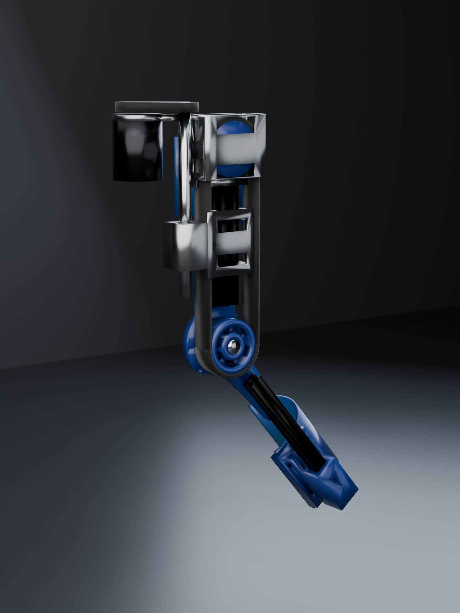

<sub>Cycles render · 512 samples · the CAD itself is below</sub>

**28.2 N·m** · **36.92 mm moment arm, constant at every angle** · **86 mm proud of the knee** · **0 clashes in 107 poses**

</div>

---

> [!WARNING]
> **This is not a validated medical device.** No FEA has been run — every number here is a
> hand calculation, and the ones that matter are shown so you can check them. Cuffs are
> sized nominally for 1.75 m / 80 kg **against a cone phantom, not a measured limb** — see
> the cuff section below. Do not fit this to anyone without a clinician in the loop and a
> bench test under the loads listed.

## The problem

A patient a year out from knee surgery, struggling with walking and — particularly —
stairs. Stair ascent is the hard case: it demands the largest knee extension moment of any
activity of daily living, roughly **1.05 N·m/kg**, and it is exactly where a weak knee
buckles.

The target is **~30% assist**, not replacement. At 80 kg that is **28.2 N·m**, over a range
of motion of **−2° to 104°** — full extension to a deep enough flexion to sit down.

Everything else in this repository follows from those two numbers.

---

## It moves like this

A full flexion cycle, 0° → 104° → 0°, from 32 poses exported straight out of FreeCAD and
rendered in **Cycles**. Left: the mechanism. Right: the same cycle with the fairings on.

<div align="center">
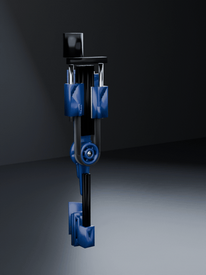 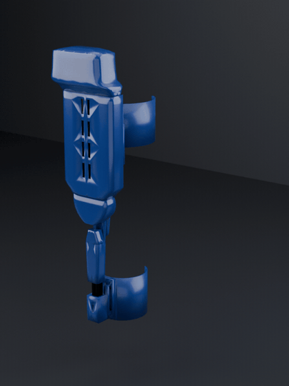
</div>

Watch the single carriage in the left animation. It is clamped to one strand of a closed
belt loop running over two identical 29T pulleys — the knee capstan and an idler. Move the
clamp by *d* and the belt circulates by *d*, turning the knee by *d/R*. That is the whole
idea, and it is why one screw does what two opposed ones used to.

<div align="center">
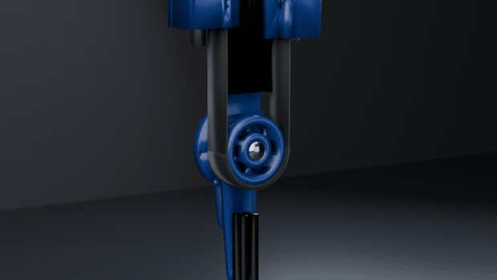
</div>

---

## How it works

<div align="center">
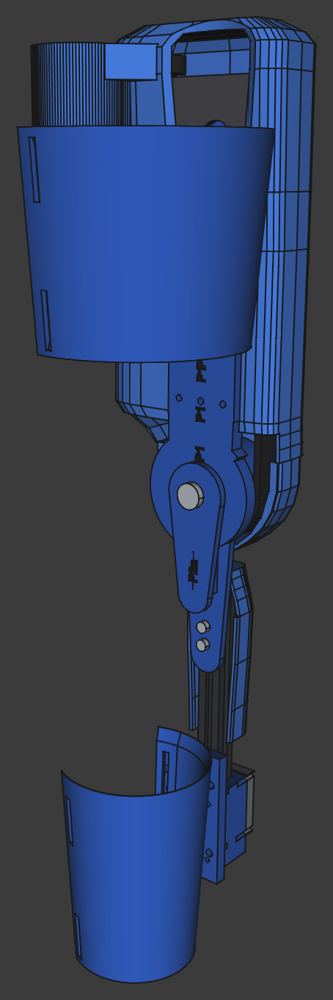 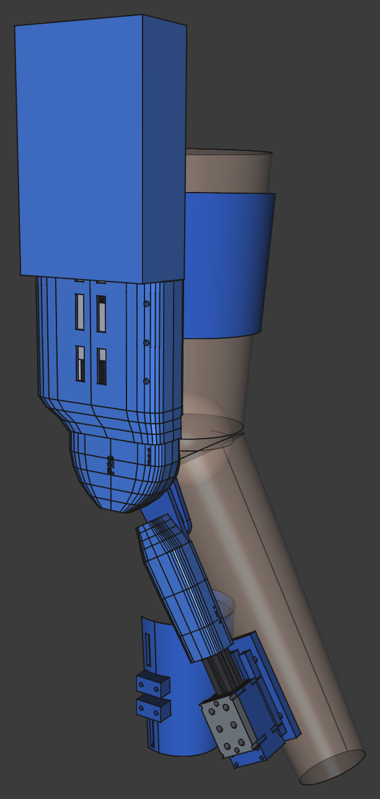
<br><sub>FreeCAD viewport · mechanism, and the same thing clad on the reference limb</sub>
</div>

A **belt capstan** at the knee, driven by **one ball screw** through a closed belt loop:

| | |
|---|---|
| **Axes** | +Y proximal, **Z is the knee axis** so Z is medial-lateral, +X posterior. This is a **lateral upright** — the whole device hangs off the outside of the leg |
| **29T HTD-8M pulley** | concentric with the knee pin, integral with the shank hinge fork |
| **A second, identical 29T pulley** | an idler on the centreline at Y 255. Equal pulleys are what put both belt strands at exactly X = ±36.9 |
| **Closed HTD-8M loop, 742 mm** | over those two pulleys. Loop length is `2πR + 2·Y_idler`, independent of carriage position |
| **One carriage, clamped to one strand** | move the clamp by *d* and the belt circulates by *d*, turning the knee by *d/R* |
| **One SFU1610 RH screw at X = −62** | no left-hand thread anywhere in the build |
| **20×40 V-slot rail, 151 mm** | aluminium V-wheel gantry on mini wheels at the \|X\| 20 corners |
| **1:1.6 overdrive, motor → screw** | 32T : 20T HTD-5M. This is where the ratio is set, not the idler |
| **C6374 170 Kv BLDC + MKS XDRIVE MINI** | ODrive v3.6 clone, torque control only, never position |

Total ratio **14.5 : 1**. The idler does not gear anything — it carries no torque, and
`2πR/lead` with the belt loop alone gives 23.2 : 1. The **link belt** supplies the rest,
and it is the right place to do it: sitting on the motor side of the ball screw's own
mechanical advantage, it carries 85 N where the capstan loop carries 764, so gearing there
costs the belt, the nut, the screw and the idler bracket nothing at all. That is what
finally reached the 14.5 : 1 this design wanted, without an SFU1616 — see
[`scripts/404_link_ratio.py`](scripts/404_link_ratio.py). What the second pulley buys is
the *return path* that lets one carriage do the work of two. How that came about, and the 725 g it saved, is
[further down](#where-this-design-is-weak).

### Why the differential is exact, not approximate

This is the part worth understanding, because it is what makes the whole architecture work.

Belt length from anchor A, around the pulley, to anchor B is:

```
L = Ya + πR + Yb
```

With a **fixed 180° wrap**, `πR` is a constant, so conservation of belt length reduces to:

```
Ya + Yb = const
```

Two equal-pitch left- and right-hand screws on one shaft give exactly `dYa = −dYb`. That
is not an approximation of the constraint — it **is** the constraint, expressed in
hardware. The belt cannot go slack and it cannot be over-tensioned by driving the motor,
because the mechanism has no way to change `Ya + Yb` at all.

Here is that being true, in the model. Same camera, same scale, orthographic; only the
knee angle differs. Watch carriage **A** (left) and **B** (right) trade places:

<div align="center">
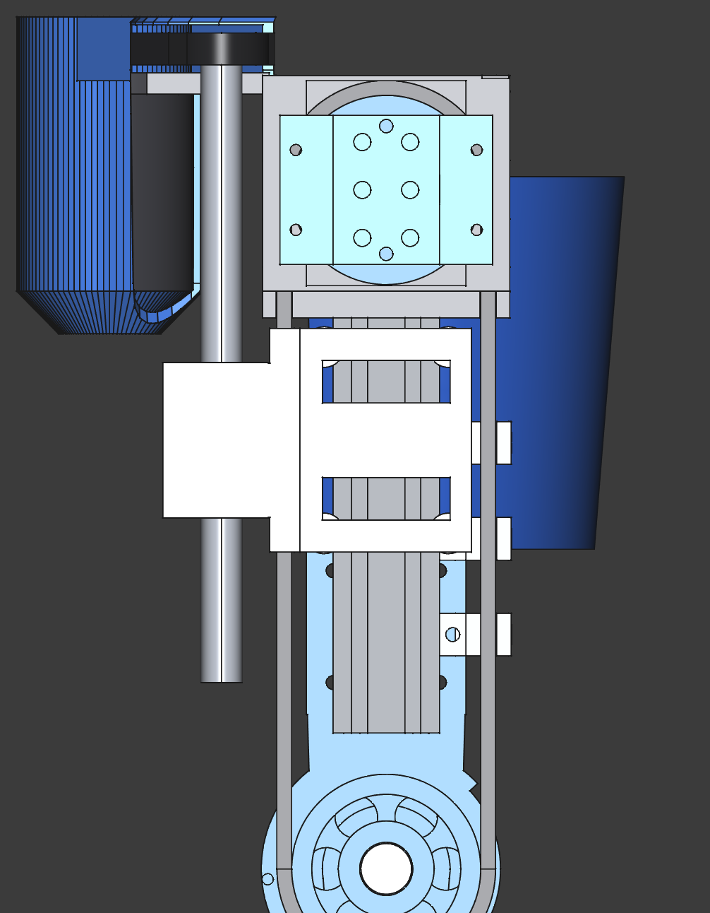 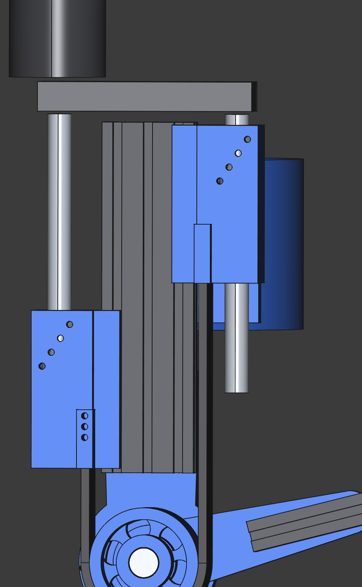
<br><sub>FreeCAD · full extension (θ = 0°) and full flexion (θ = 104°).
A drops 68.3 mm, B rises 68.3 mm, the sum never moves.</sub>
</div>

Verified constant at **242.00 mm** across all 107 poses, and re-checked on every one of the
32 animation frames above:

```
f00 theta   0.00  carrA 152.00  carrB 138.00  sum  242.00
f07 theta  41.86  carrA 125.03  carrB 164.97  sum  242.00
f15 theta 103.00  carrA  85.62  carrB 204.38  sum  242.00
f23 theta  62.14  carrA 111.95  carrB 178.05  sum  242.00
```

**This only works because both runs are parallel.** With an angled run, `Ya + Yb` becomes
nonlinear in θ and the two rigid screws fight the belt. Parallel runs are not a styling
choice; they are load-bearing on the maths.

### The second gift: a constant moment arm

<div align="center">
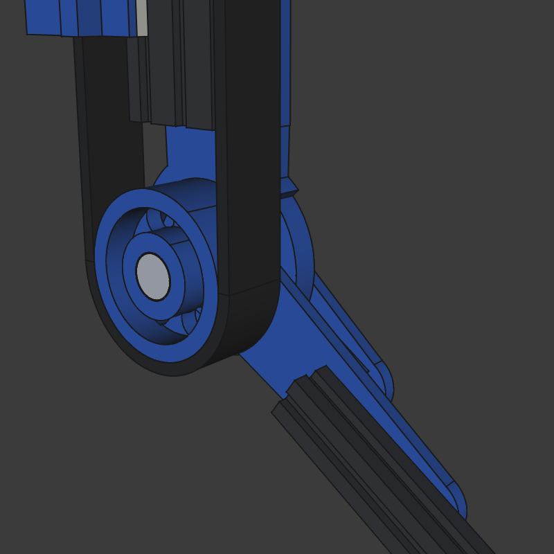
<br><sub>FreeCAD · the 29T capstan, the yoke, and the 180° wrap</sub>
</div>

A capstan's moment arm is its pitch radius, and a pitch radius does not change with angle.
So the device delivers **36.92 mm at 0° and 36.92 mm at 104°** — no dead spots, no torque
curve to compensate for in software, no linkage singularity. Compare a slider-crank, whose
effective arm collapses towards the ends of travel; that was the first architecture tried
here, and it is in the graveyard below partly for this reason.

---

## Four architectures that did not survive

Each of these was **built and measured**, not discarded on paper. The number in the last
column is the one that killed it.

| # | Approach | Why it died | Killer number |
|---|---|---|---|
| 1 | Rigid rod + rod ends to a clevis | Clevis put the full load in tension across two M5 T-nuts, over a 75 mm path crossing two bolted joints | **1269 N**, SF **1.16** |
| 2 | Pure belt drive, motor → knee | A single stage cannot give the ratio. 65T/14T = 4.67:1 needs 6.04 N·m from a motor that peaks at 3.5 | **6.04 vs 3.5 N·m** |
| 3 | Screw + belt + constant-force spring | Spring was pure parasitic loss, gave an unpowered flexion bias, and a skipped tooth loses position permanently | **119 N** loss, **4.2 N·m** bias |
| 4 | C-Beam 80×40 rail | Belt runs are 71 mm apart but the rail half-width is 40 mm, so the belt had to be *lifted over* the rail — giving a 57 mm hub cantilever | pin **SF 1.01**, hub **SF 0.51** — failing |

Architecture 4 is the instructive one. Switching to a C-beam looked like an upgrade: a
stiffer rail, an enclosed channel to hide the belt in. But the C-beam is *wider* than the
20×60, and once the rail is wider than the belt run spacing, the belt has nowhere to go but
over the top. That 57 mm cantilever took the PETG hub to a **safety factor of 0.51** — it
would have snapped.

The fix was to go **back** to a narrower rail and run the belt down beside it. Current
state, with the belt at the same height as the rail:

| | C-beam, belt lifted | 20×60, belt beside |
|---|---|---|
| Hub moment | 62.2 N·m | **18.5 N·m** |
| Knee pin | M10, 633 MPa, SF 1.01 | **M12, SF 5.9** |
| PETG hub | 29.4 MPa, **SF 0.51** | **SF 3.7** |

### The measurement that caused it

I had been assuming for some time that the two belt runs partly cancel at the pin. They do
not. **Both runs leave the pulley on the proximal side, so their tensions add** — 764 N of
differential plus 150 N of pretension on each side gives **1091 N net into the knee pin**.
Checking that one sign is what exposed the lifted-belt layout as unbuildable.

---

## Two findings worth keeping

**The seat law.** Any point on the shank swings to approximately its own radius
*posteriorly* at 90° flexion. So if you do not want a part digging into a chair when the
patient sits, keep its radius from the knee axis below the seat clearance. This caps the
pulley at **R ≤ 52 mm** — the 36.92 mm capstan passes easily, while the old rod pivot at
**R = 74.7 mm** did not, and that is why sitting down in architecture 1 was unpleasant.

**Belt tension cannot be servo-controlled, and never could.** The shaft fixes `Ya + Yb`, so
turning the motor changes tension *not at all*: there is no control authority, and no
sensor can close that loop. Pretension is invisible at the motor too, because it pulls both
carriages distally and the opposite screw hands cancel the torques exactly.

Worse, the differential is **too stiff to hold pretension**. 150 N is only 0.27–0.53 mm of
belt stretch, while a new HTD belt beds in by 0.7–1.8 mm — so the pretension would simply
vanish during break-in, with nothing able to take it up.

Hence the **sprung anchor**: 3 mm of travel at ~500 N/mm, which absorbs bedding-in in one
twentieth of the travel the abandoned constant-force drum needed. Cost: 1.58 mm of lost
motion, **2.45° of knee angle**. Bonus: a Hall sensor on that slide reads
its deflection as **live belt tension**, which is the only tension measurement the machine
can make.

---

## Drivetrain

Everything below is derived in [`scripts/300_drivetrain.py`](scripts/300_drivetrain.py) —
one file, so there is a single place to change an assumption.

### The screw lead is the biggest open decision

Reflected rotor inertia scales with the **square** of the total knee→motor ratio. This is
what the patient feels whenever the motor is off: a dead battery, a fault trip, or simply
the free-swing phase of every single step.

| Screw | Ratio | Screw revs over ROM | Reflected J | **vs. the limb's own J** | Peak current | Nut OD |
|---|---|---|---|---|---|---|
| SFU1605 | 46.4 | 13.66 | 0.667 kg·m² | **2.22×** | 12.4 A | 28 mm |
| **SFU1610 — built** | 23.2 | 6.83 | 0.167 kg·m² | **0.56×** | 24.8 A | 36 mm |
| **SFU1616 — target** | 14.5 | 4.27 | 0.065 kg·m² | **0.22×** | 39.7 A | 36 mm |
| SFU1620 | 11.6 | 3.42 | 0.042 kg·m² | 0.14× | 49.6 A | 40 mm |

At **SFU1605 the leg would feel roughly three times as heavy to swing as it does bare.**
For someone already struggling to walk, that is a worse device than no device at all.

And you cannot gear your way out of it. Only the **total** ratio matters, so "SFU1620 plus
a 4:1 reduction" is inertially identical to SFU1605 direct. The only levers are a lower
total ratio (which costs motor current) or a lower-inertia rotor.

**SFU1610 is the right answer, and it is what the model now carries.**

This used to carry a caveat that the 1610 nut fouled the belt by 1.1 mm and the screws had
to move out to ±62. That was wrong, and wrong in an instructive way: it compared the nut
and the belt *projected onto the X axis* — 58 − 18 = 40 against the belt's outer face, taken
then as 41.1 and since [`423_belt_envelope.py`](scripts/423_belt_envelope.py) as **38.46** — and
never checked whether they share any length. They do not. The nut sits at
`carrA + 36` and its belt run ends at `carrA − 24`, a constant **60 mm apart at every
pose, by construction**. Swept over all 107 poses the overlap is **0.000 cm³ for OD 28,
OD 36 and OD 40 alike**.

What *does* run alongside the belt is the screw shaft, and at r = 7.9 it stays clear until
|X| < 49.

Building it ([`240_nut1610.py`](scripts/240_nut1610.py) and
[`241_fixups.py`](scripts/241_fixups.py)) took three changes, two of which only the sweep
found:

- **The carriage body** has to grow to X 34…80, Z 84…128 to capture a 36 mm bore with a
  3.8 mm wall on all three faces.
- **Its top-outboard corner then clipped `P21` by 0.495 cm³** — *trap 2 again*: a
  superellipse is not 84 wide everywhere, and by Z = 128 its half-width has fallen to 83.3
  and its inner wall to ~80.3. Rather than guess a chamfer, the carriage is simply **cut by
  `P21`**. The fairing's section is constant over Y 58…300, which covers the whole travel
  band, so one cut clears every pose and the chamfer matches the fairing exactly.
- **Carriage B then hit the thigh cuff, 8.67 cm³** at X 34…70, Z 84…88. The body had to
  drop to Z = 84 for the nut and the cuff tops out at 88 — but only on the +X side, where
  it wraps further round the limb, which is why carriage A was clean and only B clashed.
  The cuff bolts to the rail's medial face at |X| < 30, so the wrap-around material out at
  X 32…82 gets a corridor cut through it.

Swept over all 107 poses: **zero hard-part clashes**, knee standoff unchanged at 86 mm.

### Motor

| | |
|---|---|
| Motor | C6374 outrunner, **170 Kv**, 14-pole (verify: count the magnets) |
| Torque constant | 0.0562 N·m/A |
| Shaft torque | 1.39 N·m at 10 mm lead · 2.23 N·m at 16 mm |
| Peak current | **24.8 A at 10 mm** · 39.7 A at 16 mm |
| Peak speed | 1160 rpm at 10 mm · 725 rpm at 16 mm |
| No-load at 38.4 V | 6528 rpm — we use 18% of it |
| Controller | MKS XDRIVE MINI, ODrive v3.6 clone, 12–56 V, ~40 A, fw 0.5.1 |
| Owned | 4 motors, 4 drives — a bilateral build is a mechanical parts question only |

### Energy

Lifting 80 kg by a 170 mm stair rise is 133 J. The knee does about half; the exo supplies
40% of that at 55% wall-to-shaft — so **49 J per step, electrical**.

| Use | Draw | Hoverboard 360 Wh | Ebike 504 Wh |
|---|---|---|---|
| Stair climbing, 1 step/s | 57 W | 6.4 h | 8.9 h |
| Level walking | 23 W | 15.5 h | 21.6 h |
| Mixed daily use | 12 W | 30.9 h | 43.3 h |

**Energy is not the constraint.** Both packs comfortably outlast a day, so the battery gets
chosen for its *mount*, not its capacity — see [`docs/BOM.md`](docs/BOM.md) §7.

---

## Packaging

<div align="center">
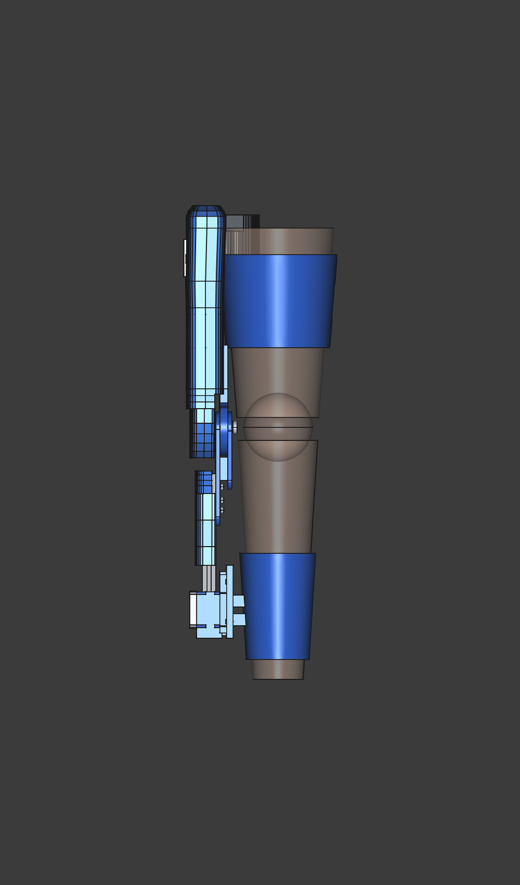 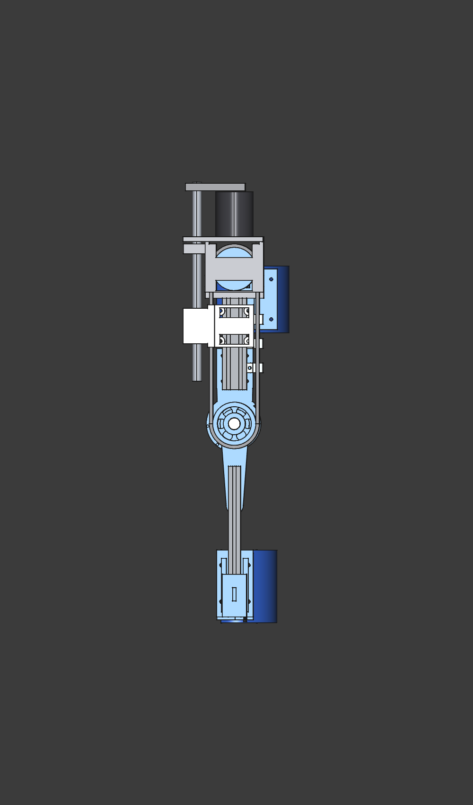 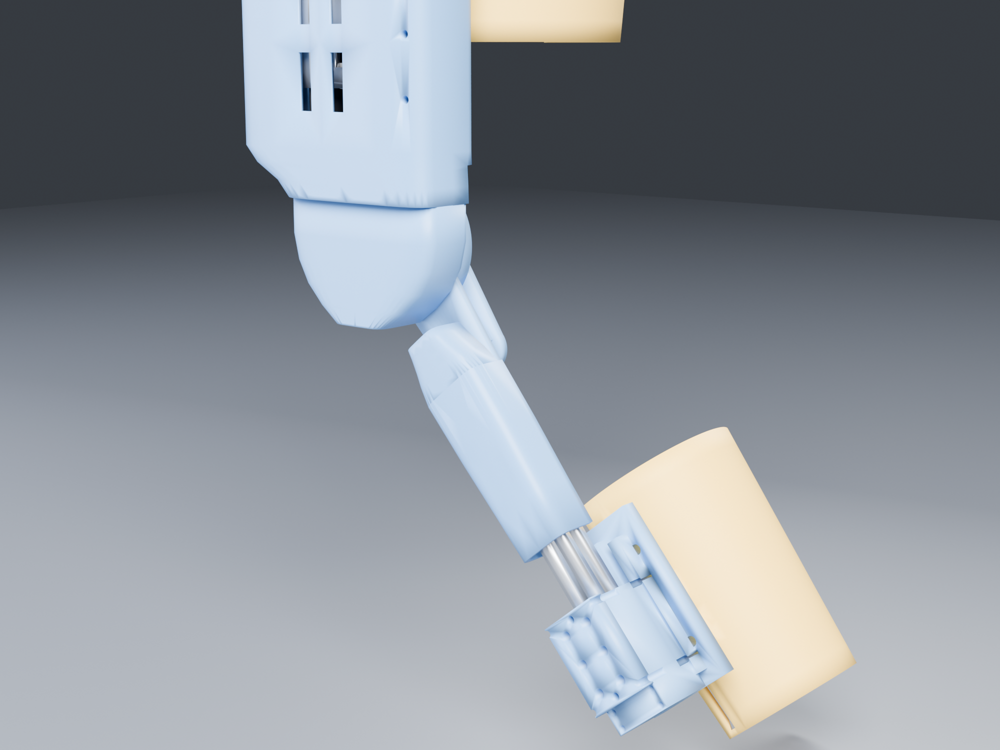
<br><sub>FreeCAD orthographic coronal and sagittal — the model itself · then the knee clad, at 40° of flexion, in Cycles</sub>
</div>

The device sits **86 mm proud of the knee** clad, 80 mm bare — unchanged by the one-screw
rebuild, which was the main thing to confirm when the rail narrowed. That left-hand
orthographic sagittal view is the one that matters — that thin edge is the number deciding whether it
fits under trousers.

### The enabling observation

The pulley's **inside** is what swings. Measured across the full sweep, nothing moving
occupies r = 41…70 mm at Z = 96…126, and once the knee pin head is recessed flush at
Z = 126, nothing at all sits above that plane. So the belt and the pulley's outer face can
be **completely enclosed by static covers** tied into the thigh fairing — no moving shroud,
no sliding seal.

Two changes were needed first, both about **swept** volume rather than static shape:

- **A4's proximal end moved from Y = −45 to Y = −70.** Its inner corner swung at r = 45 mm,
  leaving only **3.88 mm** above the belt. At −70 it swings at r = 70.7 mm, giving
  **28.9 mm**. The length was doing nothing — the fork bolts are at Y −90…−125 and the
  socket engages at −208…−318.
- **The yoke's disc went back to a full r = 47 mm**, with the fork outer cheek's *swept
  sector* (r 43…49 mm, angles 241°…43°) cut away. An earlier r = 30 had been cut "to clear
  the belt wrap" — but the yoke lives at Z 76…88 and the belt at Z 96…126. Radius was never
  the constraint. The cut was right; the reason was wrong, which meant it was cut in the
  wrong place.

### Fairing geometry

Sections are **superellipses at exponent 5.5** — a rounded rectangle, not a slab:

```
(x/a)^5.5 + (z/b)^5.5 = 1
```

The thigh fairing flares from 58 → 84 mm half-width over Y 28…58 on a smoothstep, carries
eight vent slots, and mounts on a **central spine into the rail's middle outboard slot at
X = 0** — the one channel nothing else uses, since the carriages take X = ±20 outboard and
X = ±30 side. So the mounts are never swept.

| Part | Covers |
|---|---|
| `P20_KneeCap` | an inverted-U channel — walls at X ±50, roof at Z 132 — enclosing both belt runs and both in-running nips |
| `P21_FairingThigh` | one canopy, Y 28…180 with side skirts to 206, over the screw, the nut, the carriage and both belt runs |
| `P22_DriveCap` | Y 178…334 over the bracket, the idler and the link belt. Its Y 180 station **is** P21's end section, so the two are flush with no step |
| `P25_MotorNacelle` | Y 206…334 over the motor, the link belt and the controller. A tube over the motor, because it has to be — see below — opening into a superelliptical nose over the board and ending in P22's own proximal plane |

**There is no shank cover.** There used to be one, `P24`, over the shank member at Y −208…−66. The shank rail then moved in-line under the knee joint ([`430_shank_inline_build.py`](scripts/430_shank_inline_build.py)) and there was nothing left for it to fair, so it is deleted rather than redrawn. [`406_coverage.py`](scripts/406_coverage.py) is what decides whether that is acceptable, and it reports **0 of 187 rays** reaching a moving part at 0°, 30° and 104°.

`P22` and `P25` are **two printed parts of one surface**, not two shells that happen to
meet. They are built as (cap outer ∪ pod outer) − (cap inner ∪ pod inner) and then split
along the pod's outer face, so they tile that wall exactly: 160.2 + 82.9 = 243.1 cm³,
100.0 % accounted, 0.0000 cm³ overlap. The earlier pair each cut itself back to the
*other's outer* surface, which deleted every point lying in both walls from both parts — a
thin void running the length of the seam, belonging to neither. Nothing caught it, because
an interference sweep looks for material in two places at once and this was material in
neither.

The motor pod is a round tube and cannot be anything else:

| | mm from the leg axis |
|---|---|
| motor axis | 121.1 |
| can face (axis − 31.5) | 89.6 |
| thigh surface + 3.0 comfort clearance | 87.9 |
| **room for a cover between them** | **1.7** |

An attempt to merge the cap and the pod into one lofted n=5.5 section failed on this. A
section large enough to hold both lobes has its floor 60 mm below the hardware, and the
limb cut then deletes that floor across the whole central span — at X −55, where the ball
screw runs at Z 103, the small cap's floor is at Z 78 and survives the cut at Z 68.6, while
the merged section's floor is at Z 22 and goes. `406_coverage.py` scored the merge at 16
exposed rays against 0 for the pair: the screw and the motor both became touchable. An
n=5.5 section is wider on its diagonals than a circle too, so no superelliptical pod of any
size clears the thigh at that bearing either — once the 3 mm wall is counted, even **n = 2.5**
is inside the limb (pod face 83.8 against a thigh at 84.9), and only the circle survives, at
86.1. Offsetting the section outboard does not rescue it: the inboard half-size then has to
grow by the same amount and the diagonal gets worse. What the pod got instead is a **faired foot**
— a raised-cosine flare over the +12…+100° window about the motor axis, 12 mm at its peak,
so the tube grows out of the cap's flank rather than piercing it — and a **domed nose**,
tapered over Y 209…214.5 to a 19 mm blunt end. The window costs nothing: a ray leaving the
motor axis above about +15° never reaches the thigh, and flare that ends up inside the cap
is already in the union. Closest approach to the limb is unchanged at 86.1 mm.

`P20` looks like a small nose piece in the renders and is easy to write off. The material
map at Y=0 shows what it actually is:

```
      X  -60   -50   -40   -30   -20   -10     0    10    20    30    40    50    60
Z 124      .     #     .     .     .     .     .     .     .     .     .     #     .
Z 128      .     #     .     .     .     .     .     .     .     .     #     #     #
Z 132      .     #     #     #     #     #     #     #     #     #     #     #     #
```

Two walls at X ±50 and a roof at Z 132, with the belt runs at X ±36.24…38.46, Z 96…126
sitting inside that channel. It is the only guard on either nip — `P21` starts at Y=28 and
the nips are at Y≈0 — and the channel is open only medially, through an 8 mm slot between
the yoke at Z 88 and the shroud at Z 96.5, which no finger fits through.

### How much leg this fits, and the one adjustment it has

Asked at the bench: could the motor nacelle swing out and lock further from the leg, for a fatter
leg? The nacelle *is* the part closest to the limb, so the instinct was right — but answering it
turned up something the whole repository had been blind to.

**Every limb cut here is a cylinder and the leg is a taper.** `399_drivecap.py` carves the
cladding with cylinders of r 87.9 and r 85.0 about the limb axis, which is correct at the top of
`REF_Thigh` and 20 mm too generous at the knee. A cylinder cannot express "3 mm clear of the leg"
on a conical leg, so nothing ever asked whether the **3 mm neoprene sleeve** of BOM S5 fits
underneath. [`438_limb_clearance.py`](scripts/438_limb_clearance.py) asks it, against the limb's
own measured radius at each station:

| | clearance to limb + sleeve + 0.5 mm |
|---|---|
| `A3_Motor_6374` can | +1.6 mm |
| `P27_ControllerMount` | +1.6 mm |
| the controller board | +4.1 mm |
| `A7_DriveBracket_Idler` | **0.0 mm** |
| `P25_MotorNacelle`, as first drawn | **−2.9 mm** |

So nothing in the drivetrain was too close. The offender was the **cover over the controller**,
and its cavity had 4.5 mm of slack over the board on that side: it had been sized against the
r 85.0 cylinder, which is the bare leg at the top of the taper. Flattening its section — 80 × 66
at n = 10 instead of 78 × 72 at n = 6.5, shallower toward the limb, the corner reach bought back
from the exponent rather than the semi-axis — cleared it, and made the part smaller.
[`439_limb_trim.py`](scripts/439_limb_trim.py) took the last 0.64 cm³ off the two drive shells,
and the check now reports nothing but the cuffs touching the limb.

**The swing was built and reverted, and it is worth keeping the arithmetic.** Swinging the motor
about the **screw's** axis is the only motion that leaves the link belt's 60.8 mm centre distance
untouched, so it needs no tensioner; the belt's pull on the motor acts along the line to the pivot,
so the lock would carry none of it. 10° buys 10 mm of radius and a bare can is clear of every part
to 10° (only at 20° does it graze `P22` by 0.5 cm³).

| swing | motor at | gap at the can |
|---|---|---|
| 0° | X −104, Z 62 | 7.6 mm |
| 10° | X −111, Z 70 | 17.7 mm |
| 20° | X −117, Z 79 | 27.3 mm |

What it costs is the pod: that tube is wrapped concentrically around the can, so moving the can
pierces its wall (12.8 cm³), re-centring the pod moves the seam it shares with `P22`, and
re-centring it by fusing a new tube put 51 cm³ into a cosmetic shell. Swinging the motor to fix a
cover is the wrong lever. But if a tape measure on the patient says the whole drive end has to
stand further off — which is what a genuinely fatter leg needs, since the frame's standoff is set
by the cuff and moving *that* carries the knee pivot away from the bone with it — the swing is one
constant in [`433_drive_flip.py`](scripts/433_drive_flip.py) and the numbers are in
[`437_leg_size.py`](scripts/437_leg_size.py).

Two measurement lessons from the same afternoon, both recorded in the files: a predicted 0.7 mm of
surviving wall came out at 2.90 mm because the deepest intrusion was an *edge* at bearing +149°
rather than the closest face — right about the geometry, wrong about where it mattered — and a
wall measured with one ray through a sliver's bounding-box centre read 0.00 mm because the ray
missed the material entirely.


### Where it stops

Honest limits, because they are the parts a photo hides:

- The fairing is **open below Z = 92 near the centreline**, where the limb is 3 mm away and
  there is no room for a wall. It is *not* open further out: the undersides follow the limb
  (a cylinder 3 mm proud of `REF_Thigh`, not a flat plane) and each side carries a skirt
  down to Z 83, because `406_coverage.py` found the gantry and the V-wheels reachable at
  ±14° through the longitudinal slot either side of the rail.
- **Y −66…−46 is a moving gap** — 20 mm of bare hinge plate, down from 55. A rigid shell
  here has to sweep past the static thigh fairing, so the remainder can never be closed
  and wants a fabric gaiter. See below.
- The motor cover **skims the quadriceps** — 1.2 mm off a nominal thigh against the 3.0 mm
  the rest of the cladding gets. There is no way around it: see the table above.
- `406_coverage.py` reports **0 of 187 rays** reaching a moving part first, at each of three
  poses. That is the strongest statement available here, and it is still only 11 bearings ×
  17 stations — it is a sampling, not a proof.

A collision the sweep caught only once someone read its output properly: the skirts drove
straight through `P1_KneeYoke` — 5.323 cm³ in two symmetric lumps at X ±20.4…30.0, Z 82.6…88,
for 74 mm of their length. The yoke is a 12 mm plate at Z 76…88 reaching Y 124, the skirts
hang to Z 83, and the hand-written box that was supposed to clear the fork cheek only covered
Y 20…50. It had sat in the flagged-pairs list for a full 107-pose run looking like one of the
deliberate bonds (`P21`↔`P23a/b/c`, 0.687 cm³ each, which are meant to merge).

The first fix made it worse in a way worth recording. Cutting a *box* over the yoke's
bounding extent also removed the canopy's own floor in that band — the 0.7 mm of skin
between the limb cut at r 87.9 and Z 88.6 — and that floor was the only thing between the
skin and the ball screw at −28° over Y 76…112. Coverage went 0 → 3 and named it. The cut now
follows the yoke's actual shape, dilated 0.6 mm by translated copies, which costs 6.7 cm³ of
skirt and leaves coverage at 0.

`397_recladding.py` now checks `P21` against the yoke, the hinge plate and the shroud at
build time, where it costs a second, rather than at the end of a twenty-minute sweep.

### The cuffs, which had never been calculated

Everything upstream of the cuffs — screw, bracket, belt, wheels — was sized by calculation.
The thing that actually touches the patient was not, and when
[`408_cuff_loads.py`](scripts/408_cuff_loads.py) was finally pointed at it, it found that
**neither cuff fitted the limb.** Both phantoms are cones; both cuffs were cylinders.

| | before | after |
|---|---|---|
| thigh cuff | floated over its distal half, bore on a **47 mm band at the proximal rim** at **~40 kPa** | conical, bears across all 140 mm at **12.5 kPa** |
| shank cuff | **never touched the limb** — 15–23 mm of air, closest approach 7.78 mm | conical, 160 mm wide, **12.2 kPa** |

40 kPa against a ~15 kPa sustained-comfort ceiling, concentrated at a shell edge, on a limb
with post-operative circulation, is not a comfort problem — it is how braces injure people.

The sweep had been reporting this for months and nobody read it. It flags
`P5_ThighCuff ∩ REF_Thigh` at 0.836 cm³ every single run, and it has **never** flagged
`P7_ShankCuff ∩ REF_Shank`. The absence was the finding.

Three other things came out of the same pass:

**The load that should drive the design is not the assist.** All 3.78 kg hangs lateral,
~95 mm off the limb axis, which is a **constant 3.52 N·m roll torque** trying to rotate the
brace around the leg — present with the motor off. Resisting it by friction needs ~31 N of
strap tension per cuff, *repeatably*, because if it is not repeatable the device sits at a
different roll angle each day and the knee axis stops lining up with the patient's.

**A neoprene sleeve is the skin interface**, not an EVA pad. It raises the governing friction
coefficient from 0.4 to ~0.6 worst case, so the strap needs **21 N instead of 31 N**; it
bridges the shell rim instead of letting it dig; it moves the sliding interface off the
patient; and it washes. What it cannot do is bridge a 20 mm gap — a compliant layer cannot
fix geometry, which is why the cones were still necessary.

**The closure is 38 mm nylon webbing, 2:1 through a D-ring into a cam buckle**, with a
side-release buckle in the loop. Not lace: at 31 N across the open side of the cuff a 3.5 mm
lace is ~90 kPa on soft tissue against 8.3 kPa for 38 mm webbing, so a laced brace needs a
separate tongue and webbing is its own. And this is a **powered** device — one squeeze gets
it off in ~2 s, against ~8 s to find and release a cord lock. That is the only safety
argument in the whole analysis and it is the one that settled it.

The shells now carry **rolled rims** at both ends, because the edge is where concentration
lands even once the cone matches, and the gap to the limb is **4.00 mm, constant across the
full width and every bearing** — sleeve plus 1 mm of donning air.

One thing the rebuild exposed: the old shank cuff sat at r 64 because that is what it took to
reach `P6_ShankSocket`, not what it took to fit a leg. It had been sized to the structure.
Sizing it to the limb drops it to r ≈ 47 and it now reaches the socket on a riser.

And one cost, stated because it is the kind of thing that only shows up on a person. The
old cuff wrapped **posterior-lateral only** (0…110° and 300…355°) and never reached the
medial side. Wrapping 200° to get the pressure down puts the shell **8.0 mm proud of the
medial skin** — 3 sleeve + 1 donning air + 4 wall, which is the floor for any cuff with a
sleeve, not something that can be optimised away. The medial envelope went from Z −76.2 to
−89.8. Thighs pass close at midstance, so this is worth watching at the first fitting; if it
catches the other leg, the trade is wrap −105° → −85° plus 20 mm more width, which lands at
12.2 kPa and is still under the ceiling.

### Why the shank looks bare, and how much of that is necessary

A fair question to ask of the renders. Measured coverage along the limb axis:

| | Hardware span | Faired | Coverage |
|---|---|---|---|
| Thigh | Y 0…320 (320 mm) | `P21` 28…206, `P22` 180…334, `P25` 178…326 | **91%** |
| Thigh, counting `P20_KneeShroud` over Y 0…28 | | | **100%** |
| Shank | Y −328…35 (364 mm) | `P24` Y −208…−100 | **30%** |

30% sounds bad and mostly is not, for three separate reasons that are worth keeping apart:

**Most of the shank has nothing to fair.** Every moving part of the transmission — the ball
screw, the nut, the gantry, both belt strands, the idler and the motor — is on the thigh. Below the knee there is a rail, a hinge plate, a socket and a cuff, and relative
to the shank *nothing moves at all*. The one genuine pinch hazard down there is the belt
entering the capstan, and `P20_KneeShroud` already closes over both nip points. So the
shank is 30% covered by length but close to 100% covered by hazard.

**The distal 120 mm (Y −328…−208) is the socket and the cuff.** Those are closed
structural shells and the interface to the limb. Putting a fairing over a cuff would be
fairing a fairing.

**The 55 mm gap is the only real hole** — and it is smaller than stated here until
recently. The claim used to be that the shank fairing "cannot start closer than Y = −100",
on the basis that a shell from −66 sweeps to X 70.3 at 104° where the thigh fairing is
already 63.5 mm wide. That is true *of a constant-section shell*, and false as a general
statement. Sweeping candidate extensions through the full ROM against all 25 non-shank
parts at 1° steps:

| Extension | Result |
|---|---|
| Constant ±24 section to Y = −80 | clean |
| Constant ±24 section to Y = −70 | 0.35 cm³ into `P21` at 104° |
| **Tapered tip to Y = −66** (±14, Z 101…117) | **clean** |
| Tapered tip to Y = −60 | 0.20 cm³ into `P20` at 104° |

So **34 of the 55 mm can be closed** by tapering the proximal tip in both width and height
so it ducks under the knee shroud as it swings, leaving a 21 mm gap.

### A static cheek covers the whole fan — and was the wrong answer anyway

All of the above treats the cover as **shank-mounted**, which is why it is constrained at
all — a shank-mounted shell has to sweep past the static thigh fairing. A **thigh-mounted**
cover has no such problem. It never sweeps; it only has to clear the shank *laterally*,
in Z. And that clearance already exists: the hinge plate tops out at Z = 126 and
`P20_KneeShroud` already reaches Z = 133, so **Z 126.5…133 is a free lateral band**.

A static cheek sector on the knee axis, r 40…108 mm, Z 126.5…133, spanning −100°…+26°,
swept against every shank part at 1° steps over the full ROM:

| | Result |
|---|---|
| vs. the moving shank (incl. reference limb) | **clean, 0 cm³ at every pose** |
| vs. static parts | 2.62 cm³ into `P20_KneeShroud` — an overlap to *merge*, not a clash |

That covers the entire 106° fan with **no gap at all**, and no gaiter. It is a single valid
closed solid. The cheek is naturally grown from `P20_KneeShroud`, which is already static
and already at the knee, and bolted through to `P1_KneeYoke` for support — the yoke itself
sits at Z 76…88, medial of the rail, so it is the right *anchor* but the wrong *side* to
grow the skin from.

The same trick closes the top. Nothing moves above Y = 312, and the motor pokes out to
Z = 149.5, past the thigh fairing's 138. A cap of X ±95, Y 310…394, Z 86…154 is clean
against everything that moves, overlapping only `P21_ShellAnterior` by 1.22 cm³ — again, a
merge.

Both were built and both swept clean. **The cheek is not in the model**, because
geometry was never the problem with it: it is a 216 mm flat plate standing off the side
of the knee. That is ugly, and — the part that actually matters — it is a snag hazard in
its own right, sticking out laterally at exactly the height that catches a door frame.
The device is supposed to stop the patient catching on things.

And what it was covering is bare *structural plate*, not mechanism. There is no pinch
hazard out in the fan; the nips are at the capstan and `P20` already closes over both.
Trading a cosmetic gap for a plate that catches door frames is a bad deal.

So the shank tip does the work instead, tapered in both width and height so it ducks
under the knee shroud as it swings, reaching **Y = −66**. `P20` already reaches −46, so
the moving gap is **20 mm**, down from 55, and a fabric gaiter covers it. The drive cap
stays — nothing swings at the hip, so it costs nothing and the motor is a spinning bell
that genuinely wants enclosing.

Building the cap turned up two things the envelope study had not:

- **The cap could not simply butt onto `P21`.** `P21` runs at a constant a=84, b=23,
  zc=115 and then closes from Y=300, while the motor starts at Y=314 already needing
  Z 86.5…149.5. There is nowhere to put the shoulder, so `P21` is trimmed back to Y=290
  and the cap takes over the last 22 mm of canopy.
- **Two constraints set when the cap's section centre may walk outboard.** Walking `xc`
  negative early pulls the posterior wall into the drive box, which runs to X=+70 until
  Y=311; necking down early puts the motor through the wall — 1.22 cm³ of it, at
  Y 370…392. The section stays full until Y=389 because the motor ends at 388.

Two lessons in one section: the shank-fairing limit was the same mistake as the yoke radius
earlier in this project — a cut made for a correct reason, then the reason generalised into
a constraint nobody re-tested. And the better answer came from asking *which frame the
cover lives in*, which is a question the original analysis never posed.

---

## Verification

[`tools/sweep.py`](tools/sweep.py) runs a **full pairwise interference sweep with no skip list** —
107 poses, every part against every other, across ten headless FreeCAD processes in **2.5 minutes**.
The GUI-driven version it replaced ([`231_verify.py`](scripts/231_verify.py)) took about 32 minutes
in twelve chunks, because the RPC server times out at 90 s per call; `freecadcmd` has no such limit
and poses are independent, so they shard.

**Current state, both legs: zero unintended overlaps.** Six pairs report contact and all six are
meant to: the three reference limb segments intersecting each other, and the three fairing mounts
bonded into the thigh shell.

The other three checks, all of which have caught something nothing else did:

| Check | What it asks | Current result |
|---|---|---|
| [`406_coverage.py`](scripts/406_coverage.py) | from the skin, looking out, is any moving part reachable? | **0 of 187 rays** at 0°, 30° and 104° |
| [`411_printability.py`](scripts/411_printability.py) | bed, overhangs, mean wall, closed mesh | **18 of 18 watertight** (17 parts + the tooth coupon), all inside 220 × 220 |
| [`413_mark_visibility.py`](scripts/413_mark_visibility.py) | is each engraved number actually hidden? | **16 of 16 covered**, both legs |
| [`tools/readmark.py`](tools/readmark.py) | …and does it read forwards? | **32 of 32 marks**, after 12 were found mirrored |
| [`417_fastener_audit.py`](scripts/417_fastener_audit.py) | does the hardware fit the holes? | **151 holes**, every one identified; no printed part left unbolted |
| [`420_mockup_audit.py`](scripts/420_mockup_audit.py) | **is each part the part, or only its shape?** | 23 features, all present — 8 were missing |
| [`438_limb_clearance.py`](scripts/438_limb_clearance.py) | **is anything inside the leg and its 3 mm sleeve?** | nothing but the cuffs. It found three things first: the controller cover 2.9 mm deep, a 0.07 cm³ sliver of `P22`, and the fact that every limb cut here is a cylinder while the leg is a taper |
| [`902_doc_audit.py`](scripts/902_doc_audit.py) | **do these documents still describe this model?** | 6 documents, 0 stale claims |

That last one exists because this README was stale in five places at once, and every one was a fact
a script can measure that had been typed in by hand: a sweep that no longer worked that way, parts
that no longer existed, a nut that had already been redrawn, guides that were no longer sliding, a
document name two versions out of date. It checks part names against the model's object list, volume
claims against the model, every relative link, the printed-part count, the engraved-mark count and
the leg suffixes, and it exits non-zero. Finding those by hand took a session; it takes twelve
seconds now, and it caught one more the moment it was written (`P2a_KneeHub`, an abbreviation of a
part whose name is `P2a_KneeHub_Pulley29T`).

### The pulley had no teeth

Every check above asks about the **shape a part occupies**. None of them asks whether that shape
does the job, and the difference is not academic: sampled at the belt plane over 360 bearings, the
29T capstan's outer radius was 35.55 mm with a spread of **0.000**. It was a plain drum. The belt
had nothing to grip, and the sweep, the coverage rays, the printability pass, the mesh integrity
test, the engraving and its visibility fan all passed it, because a drum of the right diameter
sweeps the right volume.

[`420_mockup_audit.py`](scripts/420_mockup_audit.py) asks the other question, from a hand-written
table of required features, because only a person knows what a part is *for*. It found **eight
missing features across five of the seventeen printed parts** — no teeth on the capstan, no V-wheel
holes and no belt grip on the gantry plate, no support for the ball screw's upper end, and no way
of attaching three cladding panels. A part that fails that table cannot work; a part that passes it
is not thereby verified, because the table only contains what someone has thought to write down.

Fixing it moved three things that had been wrong for months and agreed with each other:

* **The capstan's radius was not a free choice.** The rim was built at 35.552 — the pitch line
  differential deducted twice — and the first attempt at teeth simply cut from the rim as drawn, on
  the grounds that 0.69 mm is 1.8% of torque. But BOM S2b's idler is a **bought** 29T pulley, which
  measures ⌀72.48, and BOM K1's belt is a **bought** 742 mm loop, which is 2π·36.923 + 2·255 to
  0.03 mm. A belt cannot wrap 72.48 at one end and 71.10 at the other, and on the small rim the path
  is 737.7 mm, so a 742 mm belt arrives 4.3 mm long against an idler with 3 mm of travel. The
  bought parts set the radius: [`421_pulley_teeth.py`](scripts/421_pulley_teeth.py) grows the land
  to the standard 36.237 and cuts 29 grooves into it.
* **The belt was drawn 2.7 mm outside where a belt sits.** All four belt solids were a 5.57 mm band
  resting *on* the tip circle, which is self-consistent only while the pulleys are smooth drums.
  A real belt meshes: its teeth go into the grooves and its back stands 2.22 mm outside the tip
  circle, not 5.57. [`423_belt_envelope.py`](scripts/423_belt_envelope.py) redraws the backing and
  then checks the space the teeth sweep, where nothing but the two pulleys and the gantry's land may
  be — which caught two ribs of the drive bracket standing in it and the gantry's deck edge running
  through it for its whole length.
* **So the gantry's belt tunnel was 4.1 mm too wide.** The carriage already straddled the belt in a
  closed tunnel; against a real belt the slot was oversize and the belt would ride out of any mesh.
  [`424_belt_tunnel.py`](scripts/424_belt_tunnel.py) rebuilds it to the real section and cuts
  **five HTD-8M grooves at 8 mm pitch** into its inboard wall, so the belt is gripped by its own
  teeth — 153 N each, 1.5 MPa across a groove wall — and needs no clamp part and no bolts at all.

Then the same question, asked of the parts the table did **not** yet cover, found two more:

* **The knee yoke's bolts were at the wrong rail's slot spacing.** `P1_KneeYoke` had six M5
  through its 12 mm plate at X −20, 0 and +20 — which is where a **20×60** V-slot's three cells
  put their slots, and the object is still called `A1_Extrusion_20x60_VSlot`. The rail is a 20×40:
  two cells, channels at X ±10. BOM S1 says so outright — "Its 40 mm face has slots at X = ±10,
  not X = 0" — and notes the fairing spine has to move because of it; nobody checked the yoke, so
  all six bolts on the part that carries the whole knee reaction landed on solid aluminium or off
  the edge. [`427_rail_bolts.py`](scripts/427_rail_bolts.py) fills them and drills four that line
  up. The fill is exact rather than approximate, because each hole is a plain cylinder through a
  plate whose faces are planar and perpendicular to its axis.
* **The drive bracket had no fixing at all.** `A7_DriveBracket_Idler` carries the idler at up to
  1828 N, the largest single load in the machine, and ASSEMBLY step 5 says to bolt it to the top
  of the extrusion. Its entire hole inventory was 4 × M4 for the motor, the screw clearance, the
  608 seat, two idler bearing seats and the boss — **no M5 anywhere**, and 0.000 cm³ of contact
  with the rail. It does have a 10 mm plate butted against the rail's end face, square across both
  cells, so the fixing had been designed and never drilled.

Both were invisible to a hole count, which is what `417_fastener_audit.py` and the first version of
this table both did: the yoke had six M5 and passed "a bolt pattern into the thigh rail ≥ 2" every
time it ran. The check now samples the rail at the height of its channel and asks whether a bolt at
that X could enter — **laterally**, never along the bolt's own axis, because the bought rail's
mockup carries a 2 mm web across the slot centreline that a real V-slot does not have, so a ray
fired along a correctly placed bolt reports "hits material" and one along a wrong bolt can report
clear. That web is the next thing in this file's own list: a bought part's simplification that no
printed part's geometry can be checked against.

The tooth profile is the one number in the build that arithmetic cannot settle: HTD-8M is a
curvilinear form defined by arcs this repository does not have, so the groove is a half-ellipse
approximation and `TEST_ToothCoupon_3xHTD8M` — three teeth, 2.5 cm³ — is exported to be printed and
pushed onto a real belt **before** the 10-hour capstan.

> [!WARNING]
> **The first fix was itself a mockup.** The belt clamp added for the gantry extruded its groove
> along Z and then rotated it 90° about Y "to lay the groove along X", which instead turned the
> depth axis into Z: the cut was five elliptical tunnels bored sideways through the carriage, not
> five grooves across a face. Every one removed material, so the "did this cut land in air?"
> assertion passed, and the audit's own `a belt clamp` test — two cylindrical faces of 3–7 mm —
> was satisfied by the bolt holes. **Counting holes cannot tell a clamp from a colander.** Both
> checks now measure the feature: the land is scanned along Y and must step in and out by the
> groove depth, at the belt's pitch.

> [!IMPORTANT]
> A skip list hid **six real clashes** earlier in this project, including a carriage bore
> cut along the wrong axis and a telescoping joint that did not telescope. Do not
> reintroduce one. If the sweep is too slow, make it faster — do not make it blinder.

---

## Six traps that cost real time

Recorded because each one produced a *plausible* result that was wrong, which is the
expensive kind of bug.

**1. `obj.Shape` returns geometry with the placement already applied.** A read-modify-write
while a part is posed bakes the pose in permanently. This bit twice — once during a
measurement, where `Shape.Vertexes` returned a live animated pose which I then rotated
*again*. Stop any animation timer and zero every placement before touching geometry.

**2. A boolean that severs a part returns a *valid* shape**, not an error — just with
`len(Shape.Solids) > 1`. Always `assert solids == 1 and isClosed()` after cutting.

**3. Spline lofts overshoot.** `makeLoft(..., ruled=False)` bulged sections out to X ±129
instead of ±83 and self-intersected into two solids. Use `ruled=True` with closer stations.

**4. A superellipse narrows in Z at its X extremes.** Containing a box of half-size (W, H)
requires `(W/a)^n + (H/b)^n ≤ 1`, which is *not* the same as `a ≥ W`. At n = 3.4, b = 22 the
carriage needed **a = 108**; I had used 80. Carriages, cuff, rail and belt all poked through
the walls — **eight clashes, one root cause.**

**5. An inner loft must overrun the outer at both ends**, or `outer − inner` leaves a closed
end wall. Setting the shank fairing's inner to start at Y = −102, distal of the outer's
−100, produced a wall that A4 passed straight through — a constant **0.441 cm³ at every
pose**. A constant overlap across a sweep is the signature of a static modelling error, not
a kinematic one. Read the constant; it tells you where to look.


**6. `Shape.BoundBox` overshoots on lofted surfaces.** The drive cap reports a bounding
box of Y 288…399, Z 82.4…159.5 while its actual material is Y 290…399, Z 92…159.5 — the
box comes from B-spline control points, not the surface. It is exact on prisms and
cylinders, which is why it can be trusted for the ball-nut-to-belt clearances, and loose
on anything lofted. Never quote a clearance off a bounding box without confirming it with
a boolean.

---

## Guides, and why the layout spends the axis it does

> [!NOTE]
> **This section is history.** It reasons towards MGN7H blocks and a table below still says
> "MGN7H — built"; what is actually built is **four mini V-wheels** on the extrusion's corners, and
> both carriages, both MGN7 rails and the sprung belt anchor went with the second ball screw. Kept
> because the reasoning about mounting faces — and about what an interference sweep cannot ask — is
> what led to the current layout. Current state: [`396_fixes.py`](scripts/396_fixes.py).


The carriage guides were Delrin L-gibs running in the extrusion's slots, and are now
MGN7H recirculating blocks. The load case is
not the interesting part: the 914 N of belt pull goes straight into the ball screw, and
the guide only takes the couple from the 19.7 mm offset between the belt line and the nut
axis — **176 N at each end of the carriage**. Every linear guide on the market is ten
times overspecified for that.

Friction is the interesting part, and specifically that sliding friction is *unstable*:

| | Friction | Mass | Load capacity |
|---|---|---|---|
| Delrin L-gibs | **70 N** — 7.7% of belt pull | 29 g | fine on contact pressure |
| **MGN7H — built** | **1.4 N** | **95 g** (2 rails, 4 blocks) | 1.00 kN |
| MGN9H | 1.4 N | 150 g | 1.86 kN |
| HGR15 | 1.4 N | 616 g | 7.84 kN |

Beyond the 7.6% recovered, the real argument is stick-slip: a breakaway force different
from the running force, and a μ that wanders with wear and temperature. The whole control
plan is to start at 10% assist and creep up under a physio's supervision, and notchy
low-level torque makes that hard to tune and unpleasant to wear.

**HGR15 is the wrong size** — 616 g for capacity nobody needs.

### Where the rails go, and the 0.9 mm that picked the size

They go on the **20 mm side faces**, rail centre Z = 98, which puts the block at
Z 89.5…106.5 — between the thigh cuff (tops out at 88) and the extrusion's lateral face
(108), entirely inside the carriages' existing envelope. **No dimensional cost at all.**

Getting there took two wrong answers, both from checks that were too small, and both
worth recording because they are the same mistake in different clothes.

**"The side faces clash with the belt."** Wrong for the *blocks*: run A spans
Y 0…`carrA−24` and carriage A's first block starts later, so there is a constant gap at
every pose — the same construction that keeps the ball nut clear. Swept over all 107
poses, block-to-belt overlap is 0.00 cm³ at every rail height tried. But it is right for
the **rail**, which is continuous and therefore does share length with the belt. There is
2.9 mm between the side face at |X| 30 and the belt's tooth tips at 32.86 — it was read as
5.6 mm against a belt drawn 2.7 mm too far out, so the MGN7 fallback is tighter than this
section claimed:

| | Proud of the face | Reaches | vs. the belt |
|---|---|---|---|
| MGN9 rail | 6.5 mm | 36.5 | **0.9 mm into it** |
| **MGN7 rail** | 4.8 mm | 34.8 | clear by 0.8 mm |

**"It clears the cuff."** That test was run on the *anterior* block only. The posterior
side is tighter, because carriage B carried the sprung belt anchor in exactly that corner.
*(This whole guide section is the two-screw history. Both carriages, both MGN7 rails and
the sprung belt anchor are gone — the belt is a closed loop tensioned at the idler now,
and the single gantry runs on mini V-wheels. Kept because the reasoning about mounting
faces and what an interference sweep cannot ask is what led to the current layout.)*
Three changes were needed there and none on the anterior side: the blocks move distal of
the anchor, the anchor moves outboard to X 35.6…44.2, and the tension spring rises to
Z 113 so the block passes under it. Block spacing on B drops to 34 mm as a result, so the
18.0 N·m yaw becomes **529 N per block** against MGN7H's ~1.0 kN dynamic rating — 1.9× on
a peak, not a continuous, load. Carriage A keeps 54 mm and 333 N.

**And a question no interference sweep can ask: can it be bolted on?** The first build
centred the rail on the face at Z = 98 — straight over the V-slot, which `194_layout.py`
cuts at Z 95…101. Every M2 mounting screw would drop into the slot with nothing to grip,
and M2 T-nuts do not exist for a 6 mm slot. The face leaves two solid bands, Z 88…95 and
Z 101…108, each 6.9 mm against the rail's 7 mm. The inboard one puts the block back into
the thigh cuff, so the rail sits on the **outboard** band, centre Z = 104.5, block at
Z 96…113 — which in turn pushed the tension spring up to Z 119 to stay clear of it.

Rail length is cut to what the blocks actually sweep rather than to the extrusion:
**165 mm anterior** (blocks sweep Y 67.0…220.8) and **145 mm posterior** (Y 146.7…280.5).
They differ because the carriages sit at different heights and B's blocks were pushed
distal of the anchor.

This placement also leaves the lateral 60 mm face completely free, which is what the
front-mounted screw layout below would need.

### Why the screws stay at X = ±58

Moving them to the lateral face looks like it saves a lot of width, and it does — but it
spends the wrong axis. Measured against the reference limb:

| Y | Limb radius | Device fore-aft | Proud laterally |
|---|---|---|---|
| 140 | ±72.1 | ±84 | 65.9 mm |
| 200 | ±76.9 | ±84 | 61.1 mm |
| 260 | ±81.8 | ±84 | 56.2 mm |

Fore-aft the fairing clears the limb's own silhouette by only **2–12 mm**; laterally it
stands 56–66 mm proud at the thigh and 86 mm at the knee. Lateral protrusion is what
catches door frames, chair arms and the other leg. Fore-aft is nearly free, because the
thigh is already that wide.

Put the screws on the lateral face and the ball nut has to clear the rail's Z=108 face,
so its axis sits at Z ≥ 122 (SFU1605) or ≥ 126 (SFU1610); the nut reaches Z 136 or 144,
the carriage has to wrap it, and the fairing follows to ~148 or ~156. **Knee protrusion
goes 86 → 96 mm, or 104 mm on 1610.** The return is ~32 mm per side of fore-aft, of
which only ~12 mm was ever outside the limb.

So the current layout is already spending the cheap axis. The mass of the rails lands on
the thigh, which does not swing about the knee, so it costs hip effort rather than the
reflected inertia the screw-lead decision is fighting — the cheap place to spend 219 g.

Numbers: [`scripts/310_guides.py`](scripts/310_guides.py).

---

## Sensing

<div align="center">
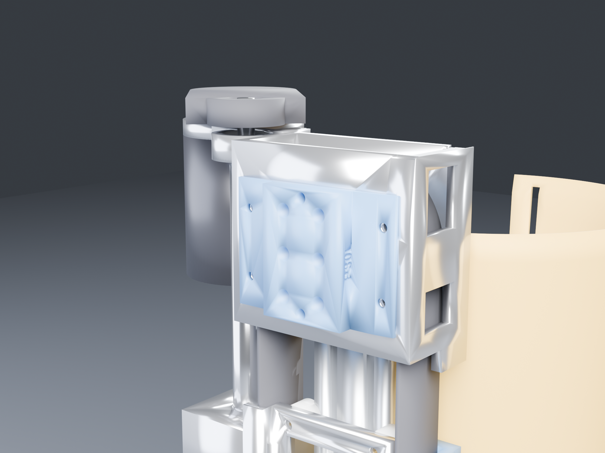
<br><sub>Cycles render · the drive head — idler, gantry and the anterior motor</sub>
</div>

| | |
|---|---|
| **Knee angle** | AS5048A, 14-bit absolute, on a 6 mm diametric magnet sunk into the knee pin's flush counterbore. Absolute at power-on, so **no homing routine** — critical, because the screw turns 6.8 revolutions over the ROM and a motor-side encoder cannot tell which one it is on |
| **Motor** | the drive's onboard AS5047P, 14-bit SPI, commutation and velocity |
| **Tooth-skip detection** | one tooth is 8 mm of belt = **12.9° of knee angle**. Comparing joint angle against motor position makes a skip unmissable — this is the monitor for the failure mode that actually matters, sudden loss of assist mid-stair |
| **Belt tension** | Hall sensor on the **idler carrier's** slotted mount, reading its deflection. A closed loop is tensioned by moving the idler, which retires the sprung belt-end anchor entirely |
| **Endstops** | magnet pockets in the gantry's side wall — hard limits plus auto-calibration of the screw↔knee map |

Full architecture, ODrive configuration, control strategy, regen handling and the bring-up
order: [`docs/ELECTRONICS.md`](docs/ELECTRONICS.md).

The headline: **torque control only, never position** — a position loop fights the patient
whenever their intent differs from the trajectory, which is most of the time. And the
failure mode is benign by construction: a ball screw backdrives at ~89%, so loss of power
leaves a free-swinging passive brace, not a locked leg. That property is worth protecting.

---

## Repository

```
docs/        BOM.md         what to buy, and the screw-lead decision
             PRINT.md       the print list — generated from the STLs, not written by hand
             ASSEMBLY.md    how it goes together, in order, by engraved part number
             ELECTRONICS.md ODrive, ESP32, control, safety, bring-up
             PRIOR_ART.md   what exists already, and why this is not that
model/       KneeExo_v6.FCStd (left) · KneeExo_v6_R.FCStd (right) · *.marks.json
stl/         15 printed parts, left leg        stl_R/  the same 15, right leg
kinematics/  kin_low.json — current pose law; legacy slider-crank kept for reference
renders/     cad/ FreeCAD viewport captures; Cycles stills and animation GIFs  (STALE,
             see Open items — they predate both the drive-cover rework and the engraving)
scripts/     chronological build and verification scripts
tools/       the things that are run repeatedly rather than once
```

**If you are building one:** [`docs/BOM.md`](docs/BOM.md) to order,
[`docs/PRINT.md`](docs/PRINT.md) to print, [`docs/ASSEMBLY.md`](docs/ASSEMBLY.md) to assemble.

Scripts are numbered in the order they were run, so the numbering is history, not structure.
Earlier numbers include all four rejected architectures above. The part of it that is still live:

```
geometry      194_layout → 195_knee → 196_carr → 197_belt → 203_makeroom → 206_fix
              → 210_flush → 217_fairing → 232_covers → 240_nut1610 → 241_fixups → 250_mgn7

the current    393_driveend → 394_lighten_merge → 396_fixes → 397_recladding
build chain    → 398_sidemounts → 399_drivecap → 409_cuffs → 502_interface_build
               run as one headless process by tools/build_headless.py, 3.4 min

marking        412_engrave (place and cut) · 416_unmark (take back out)
               · 702_mirror_marks (reflect the left leg's onto the right)

the pair       701_mirror_build  — left document → right document, Z → −Z
```

**Run the build chain headless, not through the GUI.** The RPC server's 90 s dispatch limit is not a
clean failure: `397` and `409` both exceed it, and on timeout the call returns an error *while the
work carries on in the background*, leaving a half-built document the next stage reads as finished.
Every half-applied state in this project came from that. `freecadcmd` has no such limit.

| Tool | What it is for |
|---|---|
| [`tools/build_headless.py`](tools/build_headless.py) | the whole build chain in one headless process, un-posing first |
| [`tools/sweep.py`](tools/sweep.py) | the 107-pose interference sweep, 10 shards, 2.5 min |
| [`tools/unpose.py`](tools/unpose.py) | clear a leftover animation pose — the one corruption that passes every other check |
| [`tools/markframe.py`](tools/markframe.py), [`tools/marktool.py`](tools/marktool.py) | which way a part number points, and what it is cut with |
| [`tools/readmark.py`](tools/readmark.py) | print each mark as ASCII, as the reader sees it |
| [`tools/restyle.py`](tools/restyle.py) | put colours and visibility back after a headless rebuild |
| [`tools/snapshot.py`](tools/snapshot.py) | copy the documents, registries and STLs into the repository |
| [`tools/fcsend.py`](tools/fcsend.py) | send Python to the running GUI instance (XML-RPC, port 9880) |

[`scripts/fc.py`](scripts/fc.py) is the older FreeCAD client; `tools/fcsend.py` supersedes it and
adds the pose check.

### Images

Two kinds, and the difference matters when you are reading a shape off one of them:

> [!NOTE]
> **Every image here records which geometry it shows**, in
> [`renders/manifest.json`](renders/manifest.json), and
> [`902_doc_audit.py`](scripts/902_doc_audit.py) fails if any of them disagrees with the model.
>
> This exists because six renders of a boxy `P22` and non-conical cuffs sat at the top of this
> README for weeks after both were redesigned, and **nothing could have caught it**: the link
> checker reads markdown links and these are HTML `` tags, and in any case a file that exists
> is not a file that is current. Timestamps cannot answer it either — git does not preserve mtimes,
> so every file in a fresh clone is the same age — and hashing the `.FCStd` cannot, because saving
> it changes the bytes whether or not anything moved. So the fingerprint
> ([`tools/fingerprint.py`](tools/fingerprint.py)) hashes the thing a picture actually depends on:
> every part's name and volume, to a thousandth of a cm³. Move a part and it changes; re-save, or
> rebuild from the same scripts, and it does not.

**FreeCAD viewport captures** ([`renders/cad/`](renders/cad)) are the model itself — flat
shading, edge lines, orthographic wherever the view is a technical one, and the tan
reference limb shown at 75% transparency. Nothing is retouched and nothing is
approximated. Produced by [`scripts/223_cad_shots.py`](scripts/223_cad_shots.py), then
autocropped by [`scripts/crop_cad.py`](scripts/crop_cad.py). All **eleven** are scripted and were
regenerated against the current model; four of them (`cuff_thigh`, `cuff_shank`,
`drive_antlat_clad`, `drive_antlat_open`) had been framed by hand in a session and existed in no
script, which is why they were the oldest images in the set — the same failure as the Cycles stills
below, and as `vs_leg()` and `SUFFIX` in the build scripts.

That script also used to end with `pose(30.0)`, leaving the document flexed. Nothing in it saves, so
it looked harmless; the pose then waited in the session until the next build script called
`doc.save()` and baked it in. It ends at the design pose now.

Three things that script has to get right, all of which caught me out first time:

- **`REF_Shank` belongs with the shank.** `vlow.py` has always posed it, so the clash
  sweep was never blind — but `221_render_export.py` and `222_anim_export.py` both omitted
  it. Invisible while the reference limb was hidden; wrong the instant it was shown, with
  the limb standing straight while the device flexed.
- **No standard FreeCAD view stands the device up**, because the limb axis is +Y and
  anterior is +Z. Camera orientation maps the camera frame into world and the camera looks
  down its own −Z with +Y up, so *identity* is the frontal view with the limb vertical.
- **The MCP's `get_active_screenshot` forces a standard view**, silently discarding any
  custom camera. Use the view's own `saveImage` instead.

**Cycles renders** ([`renders/flexed_40deg/`](renders/flexed_40deg),
[`renders/extended_0deg/`](renders/extended_0deg), [`renders/anim/`](renders/anim)) are
presentation: **512 samples**, AgX medium-high contrast, f/11. Materials are keyed off the `MAT__`
filename prefix [`221_render_export.py`](scripts/221_render_export.py) writes into each filename.

> [!IMPORTANT]
> **The eight-shot sets are stale, and seven of the eight cannot be reproduced.** They predate the
> drive-cover rework, the conical cuffs and the engraving. Worse, no script in this repository
> produced them: the eight camera angles were framed by hand in a Blender session, so they exist
> nowhere — not in a file, not in a comment, not recoverable from the images. The only camera
> direction the repository records is `(0.62, −0.76, 0.20)`, in `b3_frame.py` and again in
> `b5_reframe.py` and `anim_common.py`.
>
> So [`b6_stills.py`](scripts/b6_stills.py) renders **that** direction — clad and open, hero and
> knee, per pose — and nothing else. Guessing the other seven would have been easy and wrong: a
> render is a claim about what the thing looks like, and eight invented viewpoints replacing eight
> stale ones is the same problem with a newer timestamp.
>
> Two other things were broken in that pipeline and are now fixed. `b1_scene.py` keyed materials off
> a hand-written table of bare part names — including `P2b_RodClevisBlock` and `P4_Rod_8mm`, both
> deleted with the rod linkage — so feeding it the current export died on the first file with
> `KeyError: 'ALUM__A7_DriveBox'`. It now reads the `MAT__` prefix, which is what the paragraph above
> always claimed it did. And its source directory was hardcoded to the animation export, so the
> still export could not be fed to it without editing the file; `KX_SRC` chooses now.

Animation: also Cycles, 96 samples, 32 frames on `θ = 52 − 52·cos(2πi/32)` — smooth, and it loops
with no duplicated end frame because the law already returns to its start. The camera is framed
**once**, on the widest pose, and then held: refit per frame and the bounding box moves, so the whole
device appears to breathe instead of the shank swinging about a stationary knee.

[`b7_anim.py`](scripts/b7_anim.py) replaces `b4_anim.py`, which animated an architecture that no
longer exists — it reads a September `kinematics.json` carrying `rod_len`, `Dx/Dy` and `phi`, and
keyframes a rod end, a clevis and a slider-crank through them. The rod linkage became a belt over a
capstan; `b4`'s part lists still name `P2b_RodClevisBlock` and `P4_Rod_8mm` and omit every piece of
cladding added since, so the fairings, the drive wall, the three mounts and both interface bosses
would have stood still while the leg bent.

What replaced all of it is two expressions, because that is what the mechanism now is: the shank side
rotates by θ about the knee axis, and the gantry slides by `(A0 − R·θ) − A0` along the limb. Both are
the same lines `406_coverage.py` and `601_verify_fast.py` use, and the **part lists are 601's** — so a
part added to the interference sweep is animated too, instead of drifting in a sixth hand-maintained
pose list. That drift is the trap two sections below: a part can be in a check's list and never be
posed.

```bash
python scripts/300_drivetrain.py               # every drivetrain number, no FreeCAD needed
python scripts/fc.py run scripts/194_layout.py # build geometry
python scripts/fc.py run scripts/223_cad_shots.py &&   python scripts/crop_cad.py C:/Users/Josh/KneeExo_render/cad
```

---

## As a module of a full exoskeleton

The question this was built to answer is one knee. The question it will be asked next is what
a leg looks like, so [`500_as_a_module.py`](scripts/500_as_a_module.py) puts numbers on it
before any more of the design hardens around a single joint.

**A full exo cannot be eight of these.** The knee is the *smallest* of the four lower-limb
joint types — the ankle wants 38 N·m at 30 % assist against the knee's 25, and 3.5× the peak
power. Eight joints built like this one is 30.2 kg on the legs, which at published penalties
for added limb mass is a **106 % metabolic cost against a 30 % assist budget**: 3.5× upside
down. Even a perfect exo returning every newton-metre it promises would cost more than it
gives. The ways out are architectural — load to ground, remote actuation at the pelvis, or
assist fewer joints.

**Every module usable alone *or* federated** is a stronger requirement than "modular", and it
cuts against that mass. A module that works alone carries its own reaction path, controller,
safety interlock and power — exactly what makes eight unwearable. So the architecture is
modules that **shed** when they federate: local battery, second cuff, standalone MCU, e-stop
link, its own loom — **1252 g, 33 % of the module**. A federated knee is 2.53 kg against 3.78.
Shedding makes the system possible; it does not make it light.

**The cuff stops being part of a module.** A hip module and a knee module both clamp the
thigh. Self-contained they bring a cuff each — two shells fighting for the same 429 mm of
limb, each applying its own roll torque. Federated they share one, which makes the cuff a
component in its own right and means the thing to standardise is its *mounting interface*,
not its shape.

**Room to interconnect is tighter than it looks.** For a 1.75 m subject the hip joint centre
is 429 mm above the knee and the ankle 430 below, while this module reaches Y +334 and −350 —
so **95 mm at the top and 80 mm at the bottom**, and into those must fit the next joint's
bearing, its structure and the splice. The drive end is the tight one, and it already spent
its reach allowance moving the motor anterior.

**A 1 kHz host loop over one CAN bus does not fit** — 8 nodes × 2 frames × 108 bits is 173 %
of a 1 Mbit/s bus. Not a problem, but it dictates the architecture: the drives close current
and velocity locally and the bus carries setpoints at ~200 Hz (35 %); if something ever needs
kilohertz, split left and right legs onto two buses rather than raising the rate.

### The KX-1 interface, fitted at both ends

[`501_interface.py`](scripts/501_interface.py) sizes it and
[`502_interface_build.py`](scripts/502_interface_build.py) builds it. The trap was sizing for
today's load: standalone it only ever relieves a cuff, 148 N. Federated with a load-to-ground
structure the same joint carries **1472 N**. Sized for the first number it is scrap the day
the second module arrives.

**Bearing sizes it, not tension and not the bolts.** 6 × M5 at class 8.8 is 36 kN of capacity
against a 2943 N design load — never the limit. Bearing on a 5 mm hole in a printed boss is,
and 4 bolts fails at every sensible thickness while 6 passes at 10 mm. Bolt count is the one
thing in a mating pattern that cannot change later without changing both halves, so it is
worth having found now.

| | |
|---|---|
| face | 56 × 40, 10 mm boss |
| bolts | 6 × M5 at face-X −18/0/+18 by face-Y ±9 |
| dowels | 2 × ⌀5 H7 at face-X ±24 — two pins fully constrain in plane, and this interface is what sets where the joint axis lands relative to the patient's |
| frame | face-X along the module's +Y, normal pointing out |

The face points **laterally, not axially**: a lap joint costs none of the 95 mm budget and
carries bending without relying on bolt tension, which an end-butt flange cannot. `P30` sits
on `A7`'s top plate and pierces the drive shell through a port it then fills — coverage stays
at 0 of 187 rays. It needed wings to reach solid metal, because `394`'s lightening windows
leave `A7` solid only at |X| 32…40.

Four placements were wrong before one was right, every one caught by a **per-hole** engagement
check rather than an aggregate one — the first layout put two of four bolts into a lightening
window and "0.13 cm³ removed" looked entirely plausible.

### A part can be in a check's list and never be posed

`P31_InterfaceDist` was added to the interference sweep's part list and to the coverage test's
blocker list, and it passed both. It was also sitting at identity placement while the shank
rotated — **88 mm from the socket it bolts to**. It was blocking coverage rays from a position
it does not occupy, and it was drawn detached from the leg in every CAD shot.

The cause is that `406_coverage.py`'s `pose()` keeps a hardcoded shank tuple that is *separate*
from its `BLOCK` list, so a part can be an occluder and never be moved. The same split exists
in `220`, `221`, `222`, `223` and `395` — five pose lists and five part lists, maintained by
hand. Adding a part means touching both halves of all of them, and nothing complains if you
miss one.

Worth knowing because every clean result this repo produces depends on the parts being where
the checks think they are, and that is the one thing none of the checks test.

## Building the pair

The model is the **LEFT** leg. `+Z` is lateral and the whole device lives at `+Z`, so nothing
straddles the sagittal plane and every printed part is chiral. The right leg is a reflection,
`Z -> -Z`, built into its own document by
[`scripts/701_mirror_build.py`](scripts/701_mirror_build.py):
`KneeExo_v6.FCStd` (left) and `KneeExo_v6_R.FCStd` (right), 37 solids each.

### v8, and why it is one script rather than a new lineage

`KneeExo_v8.FCStd` is **v6-left plus [`scripts/459_v8_drivetrain.py`](scripts/459_v8_drivetrain.py)**, the same arrangement [`419_knee_coaxial.py`](scripts/419_knee_coaxial.py) used for its v7. v6 is ~300 scripts run in an order recorded nowhere; v8 is v6 and one file, reproducible in seconds, and that file says what changed and why. Left leg only for now.

What it carries that v6 does not: the **drivetrain the bench actually has**. A 200 mm SFU1605 set arrived — 5 mm lead, BK/BF12 ends, flanged nut, DSG16H housing — where the model was drawn around an SFU1610 at a 10 mm lead with invented ⌀8 journals. So the screw becomes ⌀10 × 11 floating / ⌀12 × 25 fixed with 135 mm of thread between; the link pulleys become **38T:20T** because 5 mm doubles the screw's own reduction and 32T would leave the leg feeling 87% heavier unpowered; the belt is an exact **54T** at the 60.83 mm centres; the screw's upper bearing goes from a 608 to a **6001** because ⌀8 was never real; the pod is bored out to clear a 38T belt run; and **`P32_ScrewFoot` exists at last** — [`445_screw_foot.py`](scripts/445_screw_foot.py) went looking for something to bolt the screw's lower bearing to and found “a yoke corner, a belt and cladding. No mount.”

**The pod had to be rebuilt around the 38T, and that was the hard part of this build.** The belt's back sits at r 33.47 from the motor axis (tip 29.67 plus the belt's own 3.8) and `P25_MotorNacelle`'s bore was r 29.7 — **6.9 cm³ of belt inside the wall**. [`446_sfu1605_set.py`](scripts/446_sfu1605_set.py) predicted 0.2 mm of this from the pulley's *pitch* radius and was out by a factor of twenty, never having added the belt's thickness. Three things had to be right to fix it:

* the bay is **grown before it is cut**. P25's dome sits ON the motor axis, so a relief bore amputates the end of the part rather than thinning a wall — which is exactly what the first attempt did, and the discarded “lose fragment” was the dome.
* the relief is **the belt's own stadium, not a cylinder**. A cylinder round the motor leaves the straight runs buried, 0.95 cm³ of them, 60.83 mm away at the screw pulley.
* the grown bay then wraps the **screw**, which needs its own running clearance bored back out of it.

P25 goes 97.7 → 103.9 cm³ for a belt bay that actually holds the belt. The relief now runs a **whole-section check** before cutting anything: if a bore would take more than 95% of the material in any 4 mm slab, it refuses and says so, because that is not a wall.

**And the motor pod is blended into the thigh.** The complaint was that it hangs off separately; measuring it found that it does not stick out — everything above the knee lies between r 145 and r 161 and the cladding is only 3–7 mm proud of its contents. What it does is **start abruptly**: slicing by sector, the posterior-lateral quarter goes from r 136.7 at Y 200 to r 158.0 at Y 205 — **21.3 mm in 5 mm, a 77° face pointing down the leg**, which is what catches on a chair or a duvet. [`464_thigh_blend.py`](scripts/464_thigh_blend.py) lofts a teardrop that grows in radius AND in bearing out of `P21_ShellAnterior`'s own shell, turning that into a **31° ramp** over Y 146…205 — 2.5 to 3.0 mm of rise per 5 mm of length, all the way. P25 goes 103.9 → 116.7 cm³.

Three things that did *not* turn out to be true, each found by measuring after assuming:

* **merging the cladding saves no mass.** P21, P22 and P25 have **zero** mutual overlap — fusing them recovers 0.00 cm³. There are no doubled walls to delete.
* **the cladding is 230 g, not 531.** The solid volume is 418 cm³ but it prints at two walls and low infill; I had applied solid PETG density to a part that is mostly air.
* **the surface was already continuous.** Across the P21/P22/P25 seams the radial steps are 0.2–2.0 mm. The seams were never the problem; the lobe's leading edge was.

What it deliberately does **not** carry, because the dimensions do not exist yet: `P3_GantryPlate` redrawn for the flanged nut and its housing, the main belt's tunnel lengthened from 5 grooves to 8 for an open-ended belt, and the joint encoder's mounting — which [`457_knee_bearings.py`](scripts/457_knee_bearings.py) invalidated by making the knee rod static, and whose magnet carrier, axial retention and sensor bracket have to be designed as one piece.

Separate documents, not more objects in one, for two reasons: every verification script works on
"each Part::Feature in the document", so doubling the objects would double every sweep and halve
what the results mean; and interference, coverage and contact pressure are all invariant under
reflection, so the right leg does **not** need the 107-pose sweep repeated. Keeping it separate
states that argument instead of burying it.

What does not mirror is the **ball screw**. Reflecting an assembly reflects its threads, so a
literal mirror wants a left-hand SFU1610 — a special order at a premium, already priced and
rejected in [`370_no_lh_screw.py`](scripts/370_no_lh_screw.py). The screw is not a structural
mirror of anything; it is a rotary-to-linear converter between two parts that *are* mirrored.
Keep the RH screw on both legs and the only consequence is a sign:

| | +motor rotation | nut travels | knee |
|---|---|---|---|
| left | + | distal | **extends** |
| right | + | distal | **flexes** |

One constant, in one place — the joint direction in firmware. The trap is doing nothing and
assuming symmetry: a right leg with the left leg's sign drives the knee the wrong way under a
28.2 N·m assist, which is not a subtle failure. See
[`700_handedness.py`](scripts/700_handedness.py).

For a pair the printed and fabricated parts double but do **not** repeat — they are new part
numbers, not more of the same: 15 L + 15 R printed (2.5 kg of filament), 2 L + 2 R aluminium
(956 g). Everything symmetric is shared: extrusion, belts, pulleys, motors, drive, V-wheels,
bearings, fasteners, neoprene sleeves, webbing.

### The part numbers carry the leg

Each printed part is engraved with its number **and its leg letter** — `P5L` and `P5R` — 0.8 mm
recessed, on a face that is hidden once assembled, by
[`412_engrave.py`](scripts/412_engrave.py). The pair is the reason the letter is there at all:
the two cuffs, the two drive-shell halves and the three fairing mounts are already hard to tell
apart on the bed, and with two legs in the same print queue there are thirty parts, not fifteen.

Three things this costs, all of them paid rather than argued away:

- **A mirrored mark reads backwards**, so the right leg cannot inherit the left's engraving. The
  mirror is taken from a fully *un-engraved* left leg, and each leg is then engraved through the
  same code with its own letter. Four parts live outside the `393…409` rebuild chain and keep
  their marks forever, so `412` also has a **fill** mode that rebuilds the original cutting tool
  and fuses it back, verified by probing the skin before and after (59% solid -> 100%).
- **One more character needs more room.** `P24L` is 5.5 mm longer than `P24` at 8 mm, which was
  enough that the placement search found no smooth patch at all on two parts. The cap-height
  ladder now steps 8 -> 5 -> 4 mm; `P24` sits at 4 mm and `P1_KneeYoke` needs an explicit site,
  because its surface satisfies no automatic search.
- **Where every mark went is now recorded** next to the document, in `<doc>.marks.json`, and the
  visibility check reads it. It used to read a table copied by hand from `412`'s printed output,
  and adding the leg letter moved five of the fourteen marks — a hand-copied table would have
  been testing bare surface and reporting it covered.

### Nothing was reading the part numbers

Twelve of the fourteen marks were cut as **mirror images**, and every check in this repository
passed them. `412` verified the cut removed a plausible volume; `413` verified no ray escapes from
the mark's surface; `411` verified the mesh. None of them asks what the glyphs *say*.

The cause was duplication. `412` built the text frame inline, four times, once per mark style — and
three of the four were left-handed. A glyph reads forwards only when the layout's reading direction
is the reader's right hand, and for a reader standing on the open side of the surface looking along
`into` (the direction the material lies), with their head up along `up`, that is

    right = into × up

Get the sign wrong and the mark is still 0.8 mm deep, still on a hidden face, still one clean
solid, and still unreadable. It cost a full re-engraving of both legs.

Three things came out of it, and they are the shape of the fix rather than the fix itself:

- [`tools/markframe.py`](tools/markframe.py) is the single authority for which way a mark points,
  with the rule stated once. `412`, `416` and `702` all call it, so they cannot disagree again.
  It also carries a `legacy` flag that reproduces the old left-handed frames, for the one job that
  needs them: *filling* a mark that was cut with them.
- [`tools/marktool.py`](tools/marktool.py) holds the shared tool-building — the text, the 6% tool
  inflation that avoids fusing across coincident faces, the `removeSplitter`-then-raw-fuse
  fallback, the skin probe. Same reason.
- [`tools/readmark.py`](tools/readmark.py) prints each mark as ASCII, sampled from the reader's own
  viewpoint, so "does it read forwards" is now a check and not an assumption. No renderer, no
  screenshot: sample 0.4 mm inside the material and print `#` where material remains.

Removing the bad marks was its own problem. [`416_unmark.py`](scripts/416_unmark.py) rebuilds each
cutting tool from the registry and fuses it back, verified by probing the skin before and after
(59% solid → 100%). It worked on 13 of 14. The shank fairing refused every variant — at tool
inflation 1.0 the volume came back exactly right and the solid was still broken — so it was
rebuilt blank from its own generator instead, which meant making `217_fairing.py` and
`232_covers.py` run headless. A part that resists booleans is better regenerated than repaired.
(That part is gone now; the lesson is not.)

Two more of the same kind, found while mirroring the right leg. `P31_InterfaceDist`'s mark
station was **15 mm above the part** — the socket's top came down to Z 98 and the station still
said 123 — so 412 cut nothing, 413 found nothing visible, `readmark` rendered the site as solid,
and the part went out unnumbered on **both** legs. And [`702_mirror_marks.py`](scripts/702_mirror_marks.py)
refused two of sixteen because its "is this already engraved" gate was an absolute skin
threshold: P22's reflected site reads 79% against a threshold of 80%, so it tried to fill glyphs
that had already been filled, added 0.000 cm³, and skipped the part instead of cutting it. Both
checks passed for years by having nothing to find.

### What is in the repository, and what the repository is missing

`model/` holds both documents and both mark registries; `stl/` is the left leg and `stl_R/` the
right. They are COPIES — the working files live at `C:/Users/Josh/KneeExo_v6*.FCStd` because ~300
scripts hardcode that path — so [`tools/snapshot.py`](tools/snapshot.py) copies them in and, run
without `--write`, says what has drifted. It is worth running before every commit: after both legs
were re-engraved, `model/` and `stl/` still held the previous commit's parts, the ones whose
numbers were mirror images, and nothing said so.

The `<doc>.marks.json` registries are tracked because they are inputs, not logs. `702` reads the
left leg's to place the right leg's marks, `413` reads it to know what to test, `416` reads it to
take a mark back out, and `readmark` reads it to print what each one says.

The binary `.FCStd` is tracked too, in a repository whose whole point is that the scripts are the
source, because **the document is not reproducible from the scripts alone** — it is ~300 of them run
in an order recorded nowhere, over weeks. `tools/build_headless.py` reproduces the last eight
stages in 3.4 minutes; everything before that exists only in the file. That is a real gap, not a
convention, and it is on the open-items list.

### Two documents means two of everything downstream

STLs export to a directory named after the document (`KneeExo_v6_STL`, `KneeExo_v6_R_STL`), one
per leg. The part object names are identical in both files, so a single shared folder would
quietly leave one leg's STLs under names that look like a complete set.

## Open items

- ~~**The knee bushings have nowhere to sit**~~ — **fixed, with a bearing instead of a bushing.**
  BOM K3 asked for two M12 flanged bushings; a ⌀12-bore bushing needs a 14–16 mm seat and the knee
  axis had only ⌀12.3 pin clearance, so they had never been modelled and a steel pin ran directly in
  printed PETG. A plain bearing was the wrong part anyway: at 764 N it puts a **0.69 N·m friction
  deadband** at the hinge against **0.007 N·m** for a sealed ball — a stiff hinge on a limb that is
  supposed to swing freely when the device is off, which is the property the whole 14.5:1 drivetrain
  was sized around. [`418_knee_bearing.py`](scripts/418_knee_bearing.py) seats a **6001** (28 × 12 × 8,
  SF 3.1) in `P1_KneeYoke`, where the hub straddles it so the load is symmetric and it sees no cocking
  moment — the one place it could go, since the yoke is solid out to r 43–55 and the pulley rim is at
  r 35.5, so no bolt circle could ever have passed between two hub halves. Bonded, not pressed: PETG
  creeps and a press fit is gone in months. The remaining ⌀12.3 bores are in the hub, which the pin's
  collars **clamp** — nothing printed turns against steel any more, and
  [`417_fastener_audit.py`](scripts/417_fastener_audit.py) now checks that as a standing question.

- ~~**A better knee exists and is not built.**~~ — **built, in a second form.** [`457_knee_bearings.py`](scripts/457_knee_bearings.py) moved the joint into the belt plane on both legs, using **two 6001s at Z 96…104 and Z 118…126** rather than 419's single 6808: a lone ring reacts tilt only inside its own race width, order 10 N·m, where a pair reacts it as a couple over 22 mm and takes ~52. 419 had weighed a two-bearing fork and rejected it on "two ⌀95 seats that must be coaxial, in printed parts" — true of 6815s, ordinary of ⌀28. P2a went 148.1 → 134.2 cm³ and the pin, its collars, the hub's lugs and the clamp stack are all gone. **419 still has what this gave up**: a hollow ⌀40 centre for cabling, and 47 g. The original note follows. The pin-and-6001 joint is sound, but the bearing sits
  beside the belt rather than in it, and the pin still passes through the hub's plastic (clamped, so
  it does not rub — but it is three parts and a clamp stack where one bearing would do).
  [`419_knee_coaxial.py`](scripts/419_knee_coaxial.py) models the alternative in its own document:
  a **6808-2RS (40 × 52 × 7) nested inside the toothed ring**, in the plane of the belt. The tooth
  root circle is ⌀65.6 (⌀64.3 before 421 corrected the tip radius), so a bearing under about
  ⌀63 fits inside it with 6.3 mm of rim — and the belt
  pull then passes straight through the bearing plane instead of 20 mm to one side of it, which on a
  single 6815 beside the teeth would have been 764 N × 0.020 = **15.3 N·m of moment on one raceway**.
  It passes the 107-pose sweep, keeps the full belt land, is **47 g lighter**, and opens a **⌀20 hole
  straight through the knee** for cabling — which is worth more to the exoskeleton than to this
  device.

  Not built because it still needs coverage, printability, re-engraving and the mirror, and because
  `v6` is the one with teeth in it: [`421_pulley_teeth.py`](scripts/421_pulley_teeth.py) would have
  to be run against that document too, and `v7`'s tooth root circle is exactly what its nested
  bearing has to fit inside. Two things it taught that the sketch did not: cutting the stub clearance
  **split the pulley in two**, since the 165 mm shank plate's only path to the rim ran up the middle
  where the stub now goes (so the shank has to wrap the stub — which is what "the bearing is the only
  thing crossing the joint" looks like drawn); and a fuse needs real interference, because two
  attempts left 0.1 and 0.05 mm gaps and the solids merely touched.
- **The three fairing mounts are not anchored where the documents say.** BOM S2b's neighbours and
  ASSEMBLY step 22 both describe `P23a/b/c` going "into the extrusion's posterior side slot at
  Y 88, 124 and 160 — one M5 each, on rubber grommets, isolating rather than rigid". Each mount
  does have exactly one M5, and it is **vertical at X 25** — outside the rail, which spans
  X −20…20, so it cannot enter the posterior slot at any Z. What it actually passes through is
  `P1_KneeYoke` (mounts a and b) and up into `P21_ShellAnterior`. So the canopy's three mounts are
  tied to the yoke and the canopy, not to the rail, and the grommet isolation the documents
  describe is not in the model.
  **This is a design decision, not a defect to patch**: anchoring to the rail's posterior slot and
  anchoring to the yoke are different answers about how vibration reaches the shell, and the
  second one leaves `P23c` at Y 160 with no yoke under it (the yoke ends at Y 124). Decide which,
  then draw it. Found by [`420_mockup_audit.py`](scripts/420_mockup_audit.py)'s question applied
  to a part the table had already passed on "a bolt into the extrusion slot ≥ 1".

- ~~**Four printed parts have no fastener holes drawn**~~ — **fixed.** `P3_GantryPlate_Printed`
  carried the ball nut and rode on four V-wheels while containing exactly two cylinders, both
  ball-screw clearance: the wheels and the nut were separate solids that happened to sit in the
  right place, and nothing bolted to anything. `P20_KneeShroud`, `P22_DriveCap` and
  `P25_MotorNacelle` were the same, though they are cladding rather than structure. No diameter
  table could notice this, because a table only reports what is there;
  [`417_fastener_audit.py`](scripts/417_fastener_audit.py) asks the absence question too, and
  [`420_mockup_audit.py`](scripts/420_mockup_audit.py) asks it per feature. The gantry now has its
  four M5 wheel bolts at |X| 23.36, two M5 set screws locking the flangeless nut against rotation,
  and a five-tooth belt land; the three cladding panels have two M4 each into the structure they
  cover. **The cladding fixings are a decision, not a calculation** — bolts were chosen because
  they are serviceable, and clips or bonding would both work.
- ~~**The two fabricated aluminium parts**~~ — **gone; both print.** `S2d` and `S2e` were the only
  parts in this build needing a workshop, and neither was ever sized by load:
  [`400_bracket_stress.py`](scripts/400_bracket_stress.py) had the bracket 50× overbuilt at 4.3 MPa
  against aluminium's 240. In PETG the governing rule is creep and bearing, not yield, and
  [`802_no_metal.py`](scripts/802_no_metal.py) puts 6 mm plates at 9.8 MPa with the idler bearings
  seated in them at 5.9 — where a bare 10 mm axle through plastic would be 15.2 and bed in.
  Printing both **saves 241 g**, because 1.27 g/cm³ against 2.70 beats the extra section. Every
  metal part left in the build is bought: extrusion, screw, nut, bearings, pulleys, motor, fasteners.
- **No FEA.** Hand calculations only.
- **The document is not rebuildable from the scripts.** `tools/build_headless.py` reproduces the
  last eight stages; the ~290 before them ran in an order that exists nowhere, so `model/*.FCStd`
  is tracked as source rather than as an artifact. Whether that is worth unpicking depends on
  whether this design gets built a second time.
- ~~**Screw lead unsettled**~~ — **settled and built.** 10 mm, and the CAD nut is now the OD 36
  SFU1610 flangeless (`A2b_BallNut_SFU1610`, 36 × 42 × 36 in the model), on the axis at X = −62.
- **Printed mass ~1.65 kg per leg**, 3.3 kg for the pair, over 17 parts and about 103 printer-hours
  each — see [`docs/PRINT.md`](docs/PRINT.md), which is generated from the STLs rather than written
  by hand. It was 1.38 kg over 15 parts until [`802_no_metal.py`](scripts/802_no_metal.py) printed
  the gantry plate and the drive bracket, which ADDS 270 g of filament here and removes 511 g of
  aluminium from the machine. Before that it read 1.59 kg, because it counted two parts that no
  longer exist: `P3b_CarriageB` and `P11_SprungAnchor` went with the second ball screw. The
  remaining candidates for a diet are `P21_FairingThigh` (165 cm³), `P5_ThighCuff` (161 cm³),
  `P22_DriveCap` (152 cm³), `A7_DriveBracket_Idler` (137 cm³),
  `P1_KneeYoke` (134 cm³) and `P2a_KneeHub_Pulley29T` (134 cm³ — **it was 148 until
  [`457_knee_bearings.py`](scripts/457_knee_bearings.py) deleted the 44 mm of reach it only
  had because the bearing sat beside the belt instead of in it**).
- ~~**Carriage guides are sliding, not rolling**~~ — **changed.** Four **mini** V-wheels
  (`P10a-d_VWheel_Mini`, OD 15.23) on the extrusion's corners, 70 mm apart in Y. A solid wheel
  reaches |X| 37.6, inside the belt's backing at 36.24…38.46; a mini reaches 31.0 and clears the
  belt's tooth tips at 32.86 by 1.86 mm. [`396_fixes.py`](scripts/396_fixes.py)
- **The motor sits at the hip**, where the reference limb model ends (Y = 300). Its 100 mm
  clearance is measured against nothing and needs a fitting check on the patient.
- **Belt tooth-shear figures come from continuous-duty power ratings**, which carry fatigue
  derating for high-speed running. A slow capstan can run closer to the cord limit — check
  against the actual belt's data before committing.
- **Acoustics are unmeasured.** Ball nut recirculation (~290 Hz) is the likely dominant
  source and the fairing is the likely radiator, since it hangs off a rigid spine into the
  rail. Analysis and mitigations in [`docs/ELECTRONICS.md`](docs/ELECTRONICS.md) §9; bench
  measurement is now step 2 of bring-up. The one-screw rebuild changed the guide answer: a
  20×60 fouls the belt with any wheel, but the 20×40 it now uses clears a **mini** V-wheel
  by 4.6 mm. Not a solid one — a V groove seats the corner apex at the bottom of the groove,
  so the wheel centre stands off along the 45° bisector and a solid wheel still fouls by
  2.0 mm. `320_rail_section.py` put the centre *on* the corner and so claimed both fit;
  corrected there and in [`396_fixes.py`](scripts/396_fixes.py). The open question is the
  mini wheel's load rating against the 362 N per wheel the yaw couple puts on it — if that
  is tight, MGN7 on the same 20×40's side faces has 7.6 mm of clearance and 2.8× margin,
  where on the 20×60 it had 0.8 mm. **OpenBuilds publishes no load rating at all** — only
  Delrin's 63 MPa compressive strength — so
  [`401_vwheel_load.py`](scripts/401_vwheel_load.py) computes it: at the 50 mm wheel
  spacing first built, the Hertzian contact on each 45° flank peaks at **107 MPa against a
  ~101 MPa yield onset**, meaning the wheel flattens and the gantry develops play at every
  torque reversal. Widening to **70 mm** brings it to 91 MPa — an 11% margin, thin but the
  most available, since 80 mm would push the idler proximal and proximal length is the one
  budget with nothing left in it. Costs 5 mm of rail and ~24 g.
- **Nothing checks assembly.** Every verification in this repository is interference —
  "do two solids overlap". Nothing asks whether a part can be *fastened*, whether a tool
  can reach a screw, or what order things go together in. That gap is how the rails came
  to be modelled directly over the V-slot, where their mounting screws would have had
  nothing to bite.
- **Reflected inertia is the real weakness**, not mass or torque density. At 23.2 : 1 this
  design sits at the top of the quasi-direct-drive band the field uses (8–36 : 1), and
  0.167 kg·m² costs 5–21 N·m during swing depending on acceleration. The fix is
  **SFU1616 — 16 mm lead, 14.5 : 1** — which gives 0.065 kg·m², **0.22× the limb**, on the
  motors already owned, and keeps the OD 36 nut the carriage is already bored for.
  Counter-intuitively a *bigger* motor is worse: torque goes as R²L and inertia as mR², so
  buying torque with diameter buys inertia back. A 6384 on an SFU1620 does reach 0.17×,
  but that last 4% of the limb's inertia costs 49.6 A against 39.7 A — more than the drives
  on hand will give. Not built. See [`docs/PRIOR_ART.md`](docs/PRIOR_ART.md),
  [`scripts/350_motor_kv.py`](scripts/350_motor_kv.py) and
  [`scripts/360_owned_hw.py`](scripts/360_owned_hw.py).
- **The electronics were specified for parts that never arrived.** The whole ODrive
  configuration was written for an S1 on firmware 0.6.x; the drives on hand are ODrive
  **3.6** clones on modified **0.5.1**, where not one of those identifiers exists. §5 of
  [`docs/ELECTRONICS.md`](docs/ELECTRONICS.md) is now written for the real board, but none
  of it has been run. Rescaling for the real 170 Kv motors also caught
  `dc_max_positive_current` and the pack fuse being sized off *phase* current instead of
  *bus* current — the fuse was 30 A where peak bus draw is 4.9 A.
- **The second screw is gone — one screw, one carriage, one idler.** Route the belt as a
  **closed loop over two identical 29T pulleys** — the knee capstan and a second copy of it
  on the centreline — and clamp the single carriage to one strand. The kinematics close
  from either strand independently (`Y_c = const − R·φ`), the loop length is
  `2πR + 2·Y_idler` and therefore independent of carriage position, and the 23.2 : 1 ratio
  is untouched. Built and swept: [`390_onescrew_section.py`](scripts/390_onescrew_section.py)
  through [`396_fixes.py`](scripts/396_fixes.py), verified by
  [`395_verify1.py`](scripts/395_verify1.py).

  | | two-screw | one-screw |
  |---|---|---|
  | Ball screws | 2, one **left-hand** | **1, right-hand** |
  | Carriages | 2 printed, 383 g | 1 aluminium V-wheel gantry, 192 g |
  | Extrusion | 20×60, 227 mm, 352 g | **20×40, 156 mm, 164 g** |
  | Guides | 2 MGN7 rails + 4 blocks | 4 mini V-wheels |
  | Belt | strip, two anchored ends | closed loop, 742 mm |
  | Drive-end mass | 2430 g | **1588 g** |

  **842 g off the limb — 4.66 kg → 3.82 kg, 18%** — and the left-hand screw, the build's
  only special-order part, disappears along with the requirement that two screws be
  manufactured to matching lead. Peak screw column load drops 914 → 764 N because the two
  strands now oppose on one carriage.

  Verified: **107 poses, zero hard-part clashes**, knee standoff unchanged at 86 mm proud —
  the narrower rail cost nothing laterally. The five remaining flags are all cladding.

  It is not free. The **idler bracket is the new cost centre at 326 g**, because the idler
  reaction is `2·T_b` — up to **1828 N, the largest single load in the machine**. Wind the
  loop so *extension* assist loads the strand that leaves the idler lightly and it sees
  300 N in the direction that matters; that choice is free and worth making deliberately.
  The bracket was 465 g until [`400_bracket_stress.py`](scripts/400_bracket_stress.py) put
  numbers on it: the whole load path runs at **18 MPa against 240 MPa yield** and deflects
  0.0005 mm, so it was sized by what was convenient to draw rather than by any load. 7.7 mm
  plates went to 4 mm. Still not FEA — it does not cover fatigue over a million gait cycles
  or shock loading if the belt jumps.
  Added lost motion is only **+0.14°**, not the 1–3° first estimated: both strands join the
  carriage to the capstan, so they are springs in **parallel** and the short direct strand
  dominates.
- **The cladding is re-lofted and the whole assembly now sweeps clean.** 34 parts, 107
  poses, **zero hard-part clashes and zero cladding clashes** — the only remaining overlaps
  are the reference limb's own solids and the cuff gripping the limb, both intentional.
  Knee standoff unchanged at 86 mm proud.

  | | two-screw | one-screw |
  |---|---|---|
  | Thigh fairing | ±84, 168 mm, 5-post spine into the rail's middle slot | **−96…58, 154 mm**, three posterior side mounts |
  | Drive cap | −106…84, 190 mm | **−90…54, 144 mm**, now covers the idler too |

  The **spine had to move, and not to where I first said.** A 20×40's 40 mm face has slots
  at X = ±10 rather than X = 0 — but that is the smaller problem. The gantry deck sweeps
  X −32.5…32 over Y 59…197 and the idler spans X ±36.24 over Y 218.8…291.2, so between them
  they own the rail's whole **outboard** face. I concluded from that there was no mid-span
  mount left at all and fell back to two end flanges, which was wrong twice over: it
  generalised from one face of four, and a rib spanning the section is an obstruction
  rather than a mount — it cut through the extrusion, both belt strands and the gantry.
  [`398_sidemounts.py`](scripts/398_sidemounts.py) measured the alternative instead of
  arguing it: the **posterior side face is clear at three stations across all 107 poses**,
  the anterior one is blocked at every station, because everything that had to reach
  outboard to the ball nut lives on that side. Three grommeted M5 there give real mid-span
  support *and* `ELECTRONICS.md` §9's top noise mitigation — isolate the canopy instead of
  bolting it rigidly into the rail.

  The section also went **asymmetric**: the gantry reaches X −84 while nothing on the +X
  side passes 48, so a symmetric shell would need ±93 (186 mm, wider than today). Offsetting
  the superellipse centre to X −19.5 covers −93…54 and comes out **14 mm narrower** than
  what it replaces.
- **STLs, screenshots and the committed CAD are current.** 12 meshes regenerated, the
  FreeCAD screenshots rebuilt for one moving group instead of two, and
  `model/KneeExo_v6.FCStd` now matches the live file by checksum — it had gone stale again,
  the same failure an earlier audit caught. The **Blender renders are still the two-screw
  build**; `221_render_export.py` and `222_anim_export.py` carry stale part lists, flagged
  in-file and not regenerated.

- **No firmware yet.** Architecture is specified in `docs/ELECTRONICS.md`; no code written.

---

## License

[Apache License 2.0](LICENSE) — hardware, software and documentation alike. Use it, build
it, sell it, fork it; just keep the notice and the disclaimer.

Apache-2.0 rather than MIT for two reasons that matter here: it carries an **explicit
patent grant**, so nobody who contributes can later assert a patent on the mechanism
against the people using it, and its limitation-of-liability clause is far more explicit —
which is worth having on a device somebody might build and strap to a leg.

That disclaimer is not decorative. Re-read the warning at the top before you build one.
